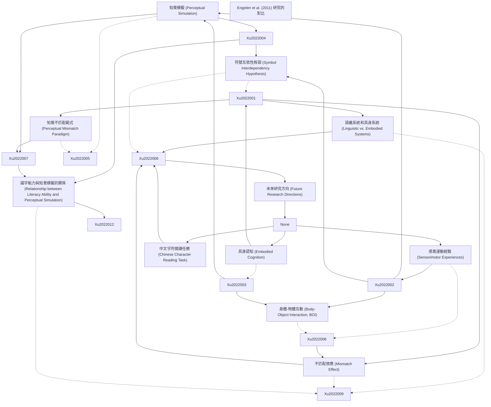

# Zettelkasten 卡片索引

**來源論文**: Educational Psychology
**作者**: Zhengye Xu, Duo Liu, Full Terms, The Author, View Crossmark, Educational Psychology, Experimental Educational, An International, Hong Kong
**年份**: 2022
**生成日期**: 2025-11-04 16:41
**卡片總數**: 12

---

## 📚 卡片清單

### 1. [知覺模擬 (Perceptual Simulation)](zettel_cards/Xu-2022-001.md)
- **ID**: `Xu-2022-001`
- **類型**: 
- **核心**: "A body of studies in alphabetic languages has shown that perceptual representations can be reactivated in language comprehension; this is a phenomenon known as perceptual simulation"
- **標籤**: `知覺模擬`, `具身認知`, `語言理解`

### 2. [具身認知 (Embodied Cognition)](zettel_cards/Xu-2022-002.md)
- **ID**: `Xu-2022-002`
- **類型**: 
- **核心**: "According to theories of embodied cognition, perceptual simulation in language comprehension occurs because conceptual knowledge acquired through sensorimotor experiences can generate corresponding sensorimotor representations and be stored in an embodied system"
- **標籤**: `具身認知`, `感覺運動經驗`, `概念知識`

### 3. [感覺運動經驗 (Sensorimotor Experiences)](zettel_cards/Xu-2022-003.md)
- **ID**: `Xu-2022-003`
- **類型**: 
- **核心**: "conceptual knowledge acquired through sensorimotor experiences can generate corresponding sensorimotor representations and be stored in an embodied system"
- **標籤**: `感覺運動經驗`, `認知發展`, `知識獲取`

### 4. [語義系統和具身系統 (Linguistic vs. Embodied Systems)](zettel_cards/Xu-2022-004.md)
- **ID**: `Xu-2022-004`
- **類型**: 
- **核心**: "In language processing, these two systems can be activated at the beginning, and the linguistic system peaks before the embodied system does. Both of these systems can facilitate language comprehension"
- **標籤**: `語義系統`, `具身系統`, `語言處理`, `雙系統模型`

### 5. [身體-物體互動 (Body-Object Interaction, BOI)](zettel_cards/Xu-2022-005.md)
- **ID**: `Xu-2022-005`
- **類型**: 
- **核心**: "Using the BOI ratings of words, i.e., the ease with which a human body can interact physically with a word’s referent in daily life, earlier studies found that readers could recognise words representing objects with high BOI ratings faster than those with low ratings"
- **標籤**: `身體物體互動`, `詞彙識別`, `具身認知`

### 6. [知覺不匹配範式 (Perceptual Mismatch Paradigm)](zettel_cards/Xu-2022-006.md)
- **ID**: `Xu-2022-006`
- **類型**: 
- **核心**: "Typically, in the perceptual mismatch paradigm, participants are asked to read and/or listen to a sentence that describes an object in a situation... Then, they are asked to respond whether the object in a subsequent picture was mentioned in the preceding sentence."
- **標籤**: `知覺不匹配範式`, `實驗方法`, `語言理解`

### 7. [不匹配效應 (Mismatch Effect)](zettel_cards/Xu-2022-007.md)
- **ID**: `Xu-2022-007`
- **類型**: 
- **核心**: "a mismatch effect, i.e., participants taking less time to correctly verify the perceptually matching pictures compared with the perceptually mismatching ones, has been reported in studies of different sensorimotor aspects, such as shape (Zwaan et al., 2002), size (de Koning et al., 2017), colour (Zwaan & Pecher, 2012), orientation (Stanfield & Zwaan, 2001), and movement (Glenberg & Kaschak, 2002) during language comprehension."
- **標籤**: `不匹配效應`, `反應時間`, `知覺模擬`, `實驗結果`

### 8. [識字能力與知覺模擬的關係 (Relationship between Literacy Ability and Perceptual Simulation)](zettel_cards/Xu-2022-008.md)
- **ID**: `Xu-2022-008`
- **類型**: 
- **核心**: "the lower the score for the Chinese character reading task, the larger the mismatch effect"
- **標籤**: `識字能力`, `知覺模擬`, `中文字符閱讀`, `負相關`

### 9. [符號互依性假設 (Symbol Interdependency Hypothesis)](zettel_cards/Xu-2022-009.md)
- **ID**: `Xu-2022-009`
- **類型**: 
- **核心**: "The symbol interdependency hypothesis (Louwerse, 2018) suggests that the concept-related representations from both the linguistic and embodied systems are activated automatically during comprehension."
- **標籤**: `符號互依性`, `語言理解`, `具身認知`, `語義系統`

### 10. [Engelen et al. (2011) 研究的對比](zettel_cards/Xu-2022-010.md)
- **ID**: `Xu-2022-010`
- **類型**: 
- **核心**: "A study in English-speaking children (aged 7–10; Engelen et al., 2011) reported similar mismatch effects between children with distinctive reading performances."
- **標籤**: `識字能力`, `知覺模擬`, `不匹配效應`, `對比研究`

### 11. [中文字符閱讀任務 (Chinese Character Reading Task)](zettel_cards/Xu-2022-011.md)
- **ID**: `Xu-2022-011`
- **類型**: 
- **核心**: "A Chinese character reading task (Liu et al., 2017) was used to examine reading ability at the word level, which was used to represent general literacy ability."
- **標籤**: `中文字符閱讀`, `識字能力`, `測量方法`

### 12. [未來研究方向 (Future Research Directions)](zettel_cards/Xu-2022-012.md)
- **ID**: `Xu-2022-012`
- **類型**: 
- **核心**: "Future studies could manipulate linguistic components (e.g., the object or the situation/ space), as well as use the approaches such as eye-tracking or neurological techniques, to investigate how and to what extent children can recognise the words included in the task for the perceptual simulation."
- **標籤**: `未來研究`, `知覺模擬`, `語言理解`, `眼動追蹤`, `神經科學`

---

## 🗺️ 概念網絡圖

---

## 🏷️ 標籤索引

### 知覺模擬
- [[Xu-2022-001]] 知覺模擬 (Perceptual Simulation)
- [[Xu-2022-007]] 不匹配效應 (Mismatch Effect)
- [[Xu-2022-008]] 識字能力與知覺模擬的關係 (Relationship between Literacy Ability and Perceptual Simulation)
- [[Xu-2022-010]] Engelen et al. (2011) 研究的對比
- [[Xu-2022-012]] 未來研究方向 (Future Research Directions)

### 具身認知
- [[Xu-2022-001]] 知覺模擬 (Perceptual Simulation)
- [[Xu-2022-002]] 具身認知 (Embodied Cognition)
- [[Xu-2022-005]] 身體-物體互動 (Body-Object Interaction, BOI)
- [[Xu-2022-009]] 符號互依性假設 (Symbol Interdependency Hypothesis)

### 語言理解
- [[Xu-2022-001]] 知覺模擬 (Perceptual Simulation)
- [[Xu-2022-006]] 知覺不匹配範式 (Perceptual Mismatch Paradigm)
- [[Xu-2022-009]] 符號互依性假設 (Symbol Interdependency Hypothesis)
- [[Xu-2022-012]] 未來研究方向 (Future Research Directions)

### 感覺運動經驗
- [[Xu-2022-002]] 具身認知 (Embodied Cognition)
- [[Xu-2022-003]] 感覺運動經驗 (Sensorimotor Experiences)

### 概念知識
- [[Xu-2022-002]] 具身認知 (Embodied Cognition)

### 認知發展
- [[Xu-2022-003]] 感覺運動經驗 (Sensorimotor Experiences)

### 知識獲取
- [[Xu-2022-003]] 感覺運動經驗 (Sensorimotor Experiences)

### 語義系統
- [[Xu-2022-004]] 語義系統和具身系統 (Linguistic vs. Embodied Systems)
- [[Xu-2022-009]] 符號互依性假設 (Symbol Interdependency Hypothesis)

### 具身系統
- [[Xu-2022-004]] 語義系統和具身系統 (Linguistic vs. Embodied Systems)

### 語言處理
- [[Xu-2022-004]] 語義系統和具身系統 (Linguistic vs. Embodied Systems)

### 雙系統模型
- [[Xu-2022-004]] 語義系統和具身系統 (Linguistic vs. Embodied Systems)

### 身體物體互動
- [[Xu-2022-005]] 身體-物體互動 (Body-Object Interaction, BOI)

### 詞彙識別
- [[Xu-2022-005]] 身體-物體互動 (Body-Object Interaction, BOI)

### 知覺不匹配範式
- [[Xu-2022-006]] 知覺不匹配範式 (Perceptual Mismatch Paradigm)

### 實驗方法
- [[Xu-2022-006]] 知覺不匹配範式 (Perceptual Mismatch Paradigm)

### 不匹配效應
- [[Xu-2022-007]] 不匹配效應 (Mismatch Effect)
- [[Xu-2022-010]] Engelen et al. (2011) 研究的對比

### 反應時間
- [[Xu-2022-007]] 不匹配效應 (Mismatch Effect)

### 實驗結果
- [[Xu-2022-007]] 不匹配效應 (Mismatch Effect)

### 識字能力
- [[Xu-2022-008]] 識字能力與知覺模擬的關係 (Relationship between Literacy Ability and Perceptual Simulation)
- [[Xu-2022-010]] Engelen et al. (2011) 研究的對比
- [[Xu-2022-011]] 中文字符閱讀任務 (Chinese Character Reading Task)

### 中文字符閱讀
- [[Xu-2022-008]] 識字能力與知覺模擬的關係 (Relationship between Literacy Ability and Perceptual Simulation)
- [[Xu-2022-011]] 中文字符閱讀任務 (Chinese Character Reading Task)

### 負相關
- [[Xu-2022-008]] 識字能力與知覺模擬的關係 (Relationship between Literacy Ability and Perceptual Simulation)

### 符號互依性
- [[Xu-2022-009]] 符號互依性假設 (Symbol Interdependency Hypothesis)

### 對比研究
- [[Xu-2022-010]] Engelen et al. (2011) 研究的對比

### 測量方法
- [[Xu-2022-011]] 中文字符閱讀任務 (Chinese Character Reading Task)

### 未來研究
- [[Xu-2022-012]] 未來研究方向 (Future Research Directions)

### 眼動追蹤
- [[Xu-2022-012]] 未來研究方向 (Future Research Directions)

### 神經科學
- [[Xu-2022-012]] 未來研究方向 (Future Research Directions)

---

## 📖 閱讀建議順序

1. [[Xu-2022-001]] 知覺模擬 (Perceptual Simulation)

2. [[Xu-2022-002]] 具身認知 (Embodied Cognition)

3. [[Xu-2022-003]] 感覺運動經驗 (Sensorimotor Experiences)

4. [[Xu-2022-004]] 語義系統和具身系統 (Linguistic vs. Embodied Systems)

5. [[Xu-2022-005]] 身體-物體互動 (Body-Object Interaction, BOI)

6. [[Xu-2022-006]] 知覺不匹配範式 (Perceptual Mismatch Paradigm)

7. [[Xu-2022-007]] 不匹配效應 (Mismatch Effect)

8. [[Xu-2022-008]] 識字能力與知覺模擬的關係 (Relationship between Literacy Ability and Perceptual Simulation)

9. [[Xu-2022-009]] 符號互依性假設 (Symbol Interdependency Hypothesis)

10. [[Xu-2022-010]] Engelen et al. (2011) 研究的對比

11. [[Xu-2022-011]] 中文字符閱讀任務 (Chinese Character Reading Task)

12. [[Xu-2022-012]] 未來研究方向 (Future Research Directions)

---

*本索引由 Knowledge Production System 自動生成*