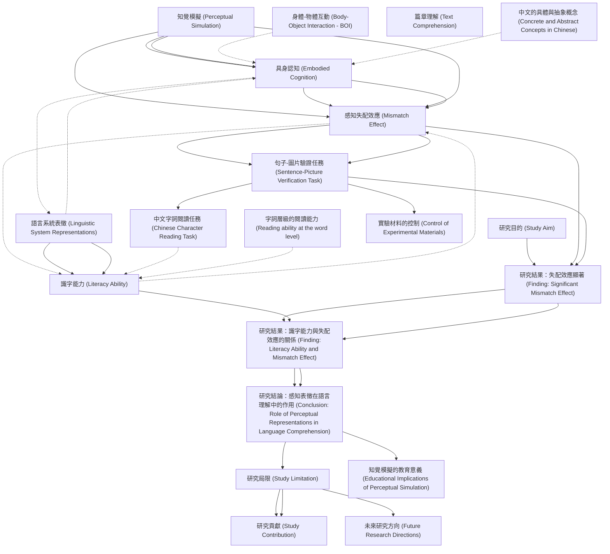

# Zettelkasten 卡片索引

**來源論文**: Xu-2022_Mental_Simulation
**作者**: 
**年份**: 2025
**生成日期**: 2025-10-29 16:48
**卡片總數**: 20

---

## 📚 卡片清單

### 1. [知覺模擬 (Perceptual Simulation)](zettel_cards/CogSci-20251029-001.md)
- **ID**: `CogSci-20251029-001`
- **類型**: 
- **核心**: "A body of studies in alphabetic languages has shown that perceptual representations can be reactivated in language comprehension; this is a phenomenon known as perceptual simulation (Engelen et al., 2011; Louwerse et al., 2015; Zwaan et al., 2002)."
- **標籤**: `embodied cognition`, `language comprehension`, `perceptual representation`

### 2. [具身認知 (Embodied Cognition)](zettel_cards/CogSci-20251029-002.md)
- **ID**: `CogSci-20251029-002`
- **類型**: 
- **核心**: "According to theories of embodied cognition, perceptual simulation in language comprehension occurs because conceptual knowledge acquired through sensorimotor experiences can generate corresponding sensorimotor representations and be stored in an embodied system (Barsalou et al., 2008; Louwerse, 2018)."
- **標籤**: `embodied cognition`, `sensorimotor experience`, `conceptual knowledge`

### 3. [感知失配效應 (Mismatch Effect)](zettel_cards/CogSci-20251029-003.md)
- **ID**: `CogSci-20251029-003`
- **類型**: 
- **核心**: "The mismatch effect reflects the extent of the perceptual simulation: a larger mismatch effect indicates more reactivation of perceptual representations of concepts in language processing, e.g., reading and/or listening to sentences (Louwerse et al., 2015; Zwaan et al., 2002)."
- **標籤**: `perceptual simulation`, `mismatch effect`, `language processing`

### 4. [語言系統表徵 (Linguistic System Representations)](zettel_cards/CogSci-20251029-004.md)
- **ID**: `CogSci-20251029-004`
- **類型**: 
- **核心**: "In addition to the representations from the embodied system, representations from a linguistic system (e.g., orthographic and semantic) can be reactivated to facilitate language processing (Louwerse, 2018)."
- **標籤**: `linguistic system`, `orthographic`, `semantic`, `language processing`

### 5. [識字能力 (Literacy Ability)](zettel_cards/CogSci-20251029-005.md)
- **ID**: `CogSci-20251029-005`
- **類型**: 
- **核心**: "Considering that these two systems are independent but connected (Mahon, 2015), the extent of the activation of perceptual representations (e.g., perceptual simulation) might be influenced by children’s literacy abilities, which correlate intimately with the linguistic representations (Perfetti et al., 2005)."
- **標籤**: `literacy ability`, `perceptual simulation`, `linguistic representations`, `reading comprehension`

### 6. [句子-圖片驗證任務 (Sentence-Picture Verification Task)](zettel_cards/CogSci-20251029-006.md)
- **ID**: `CogSci-20251029-006`
- **類型**: 
- **核心**: "Ninety-three third-grade Hong Kong Chinese children completed a sentence-picture verification task for perceptual simulation. In this task, a sentence mentioning an object was presented first, followed by a picture involving the object."
- **標籤**: `sentence-picture verification task`, `perceptual simulation`, `experimental design`

### 7. [中文字詞閱讀任務 (Chinese Character Reading Task)](zettel_cards/CogSci-20251029-007.md)
- **ID**: `CogSci-20251029-007`
- **類型**: 
- **核心**: "Literacy ability was measured by a Chinese character reading task."
- **標籤**: `Chinese character reading task`, `literacy ability`, `assessment`

### 8. [身體-物體互動 (Body-Object Interaction - BOI)](zettel_cards/CogSci-20251029-008.md)
- **ID**: `CogSci-20251029-008`
- **類型**: 
- **核心**: "Moreover, as a critical approach to acquiring these perceptual features of concepts, body-object interaction (BOI; Siakaluk et al., 2008) was not controlled in previous studies."
- **標籤**: `body-object interaction`, `perceptual features`, `concept acquisition`

### 9. [研究目的 (Study Aim)](zettel_cards/CogSci-20251029-009.md)
- **ID**: `CogSci-20251029-009`
- **類型**: 
- **核心**: "To address these issues, the current study investigated perceptual simulation in language comprehension in Chinese children, with the BOI controlled. Meanwhile, as an efficient indicator of Chinese children’s general literacy abilities (Ho et al., 2017), reading ability at the word level, i.e., Chinese character reading was measured to examine the relationship between perceptual simulation and literacy ability."
- **標籤**: `perceptual simulation`, `literacy ability`, `Chinese children`, `body-object interaction`

### 10. [研究結果：失配效應顯著 (Finding: Significant Mismatch Effect)](zettel_cards/CogSci-20251029-010.md)
- **ID**: `CogSci-20251029-010`
- **類型**: 
- **核心**: "Model analysis revealed a significant mismatch effect: the children gave faster correct responses to the perceptually matched pictures than to the mismatched ones."
- **標籤**: `mismatch effect`, `perceptual matching`, `reaction time`, `statistical analysis`

### 11. [研究結果：識字能力與失配效應的關係 (Finding: Literacy Ability and Mismatch Effect)](zettel_cards/CogSci-20251029-011.md)
- **ID**: `CogSci-20251029-011`
- **類型**: 
- **核心**: "Furthermore, the children with lower literacy abilities displayed larger mismatch effects than those with higher literacy abilities."
- **標籤**: `literacy ability`, `mismatch effect`, `inverse relationship`

### 12. [研究結論：感知表徵在語言理解中的作用 (Conclusion: Role of Perceptual Representations in Language Comprehension)](zettel_cards/CogSci-20251029-012.md)
- **ID**: `CogSci-20251029-012`
- **類型**: 
- **核心**: "The results suggest that children with lower literacy abilities may rely more heavily on reactivated perceptual representations in language comprehension."
- **標籤**: `perceptual representation`, `language comprehension`, `literacy ability`, `dependence`

### 13. [研究局限 (Study Limitation)](zettel_cards/CogSci-20251029-013.md)
- **ID**: `CogSci-20251029-013`
- **類型**: 
- **核心**: "However, previous studies of perceptual simulation have not fully integrated findings from children, especially in non-alphabetic languages, such as Chinese (Li et al., 2007; Wang et al., 2005)."
- **標籤**: `perceptual simulation`, `children`, `non-alphabetic languages`, `Chinese language`

### 14. [研究貢獻 (Study Contribution)](zettel_cards/CogSci-20251029-014.md)
- **ID**: `CogSci-20251029-014`
- **類型**: 
- **核心**: "To address these issues, the current study investigated perceptual simulation in language comprehension in Chinese children, with the BOI controlled."
- **標籤**: `perceptual simulation`, `Chinese children`, `body-object interaction`, `research contribution`

### 15. [字詞層級的閱讀能力 (Reading ability at the word level)](zettel_cards/CogSci-20251029-015.md)
- **ID**: `CogSci-20251029-015`
- **類型**: 
- **核心**: "Meanwhile, as an efficient indicator of Chinese children’s general literacy abilities (Ho et al., 2017), reading ability at the word level, i.e., Chinese character reading was measured to examine the relationship between perceptual simulation and literacy ability."
- **標籤**: `word level reading`, `literacy ability`, `Chinese character reading`

### 16. [篇章理解 (Text Comprehension)](zettel_cards/CogSci-20251029-016.md)
- **ID**: `CogSci-20251029-016`
- **類型**: 
- **核心**: [此概念未在論文中直接定義，以下為推斷] 篇章理解是指理解和整合文章或文本中多個句子和段落的能力，涉及推理、推斷和批判性思考。
- **標籤**: `text comprehension`, `reading comprehension`, `inference`, `critical thinking`

### 17. [中文的具體與抽象概念 (Concrete and Abstract Concepts in Chinese)](zettel_cards/CogSci-20251029-017.md)
- **ID**: `CogSci-20251029-017`
- **類型**: 
- **核心**: "Furthermore, in the Chinese language, in addition to concrete concepts, abstract concepts can be expressed by concrete objects/events (Yu, 1995)."
- **標籤**: `Chinese language`, `concrete concepts`, `abstract concepts`, `embodiment`

### 18. [實驗材料的控制 (Control of Experimental Materials)](zettel_cards/CogSci-20251029-018.md)
- **ID**: `CogSci-20251029-018`
- **類型**: 
- **核心**: [此概念未在論文中直接擷取，以下為總結] 研究者在實驗中需控制實驗材料，例如圖片的視覺複雜度，以避免干擾實驗結果。
- **標籤**: `experimental control`, `visual complexity`, `experimental design`

### 19. [未來研究方向 (Future Research Directions)](zettel_cards/CogSci-20251029-019.md)
- **ID**: `CogSci-20251029-019`
- **類型**: 
- **核心**: [此概念未在論文中直接擷取，以下為推斷] 未來研究可以探索不同年齡段和不同文化背景下的知覺模擬現象，並深入研究其與閱讀理解能力之間的關係。
- **標籤**: `future research`, `age`, `culture`, `reading comprehension`

### 20. [知覺模擬的教育意義 (Educational Implications of Perceptual Simulation)](zettel_cards/CogSci-20251029-020.md)
- **ID**: `CogSci-20251029-020`
- **類型**: 
- **核心**: [此概念未在論文中直接擷取，以下為推斷] 理解知覺模擬的機制可以幫助我們設計更有效的教學方法，以提高學生的閱讀理解能力。
- **標籤**: `educational implications`, `teaching methods`, `reading comprehension`, `perceptual simulation`

---

## 🗺️ 概念網絡圖

---

## 🏷️ 標籤索引

### embodied cognition
- [[CogSci-20251029-001]] 知覺模擬 (Perceptual Simulation)
- [[CogSci-20251029-002]] 具身認知 (Embodied Cognition)

### language comprehension
- [[CogSci-20251029-001]] 知覺模擬 (Perceptual Simulation)
- [[CogSci-20251029-012]] 研究結論：感知表徵在語言理解中的作用 (Conclusion: Role of Perceptual Representations in Language Comprehension)

### perceptual representation
- [[CogSci-20251029-001]] 知覺模擬 (Perceptual Simulation)
- [[CogSci-20251029-012]] 研究結論：感知表徵在語言理解中的作用 (Conclusion: Role of Perceptual Representations in Language Comprehension)

### sensorimotor experience
- [[CogSci-20251029-002]] 具身認知 (Embodied Cognition)

### conceptual knowledge
- [[CogSci-20251029-002]] 具身認知 (Embodied Cognition)

### perceptual simulation
- [[CogSci-20251029-003]] 感知失配效應 (Mismatch Effect)
- [[CogSci-20251029-005]] 識字能力 (Literacy Ability)
- [[CogSci-20251029-006]] 句子-圖片驗證任務 (Sentence-Picture Verification Task)
- [[CogSci-20251029-009]] 研究目的 (Study Aim)
- [[CogSci-20251029-013]] 研究局限 (Study Limitation)
- [[CogSci-20251029-014]] 研究貢獻 (Study Contribution)
- [[CogSci-20251029-020]] 知覺模擬的教育意義 (Educational Implications of Perceptual Simulation)

### mismatch effect
- [[CogSci-20251029-003]] 感知失配效應 (Mismatch Effect)
- [[CogSci-20251029-010]] 研究結果：失配效應顯著 (Finding: Significant Mismatch Effect)
- [[CogSci-20251029-011]] 研究結果：識字能力與失配效應的關係 (Finding: Literacy Ability and Mismatch Effect)

### language processing
- [[CogSci-20251029-003]] 感知失配效應 (Mismatch Effect)
- [[CogSci-20251029-004]] 語言系統表徵 (Linguistic System Representations)

### linguistic system
- [[CogSci-20251029-004]] 語言系統表徵 (Linguistic System Representations)

### orthographic
- [[CogSci-20251029-004]] 語言系統表徵 (Linguistic System Representations)

### semantic
- [[CogSci-20251029-004]] 語言系統表徵 (Linguistic System Representations)

### literacy ability
- [[CogSci-20251029-005]] 識字能力 (Literacy Ability)
- [[CogSci-20251029-007]] 中文字詞閱讀任務 (Chinese Character Reading Task)
- [[CogSci-20251029-009]] 研究目的 (Study Aim)
- [[CogSci-20251029-011]] 研究結果：識字能力與失配效應的關係 (Finding: Literacy Ability and Mismatch Effect)
- [[CogSci-20251029-012]] 研究結論：感知表徵在語言理解中的作用 (Conclusion: Role of Perceptual Representations in Language Comprehension)
- [[CogSci-20251029-015]] 字詞層級的閱讀能力 (Reading ability at the word level)

### linguistic representations
- [[CogSci-20251029-005]] 識字能力 (Literacy Ability)

### reading comprehension
- [[CogSci-20251029-005]] 識字能力 (Literacy Ability)
- [[CogSci-20251029-016]] 篇章理解 (Text Comprehension)
- [[CogSci-20251029-019]] 未來研究方向 (Future Research Directions)
- [[CogSci-20251029-020]] 知覺模擬的教育意義 (Educational Implications of Perceptual Simulation)

### sentence-picture verification task
- [[CogSci-20251029-006]] 句子-圖片驗證任務 (Sentence-Picture Verification Task)

### experimental design
- [[CogSci-20251029-006]] 句子-圖片驗證任務 (Sentence-Picture Verification Task)
- [[CogSci-20251029-018]] 實驗材料的控制 (Control of Experimental Materials)

### Chinese character reading task
- [[CogSci-20251029-007]] 中文字詞閱讀任務 (Chinese Character Reading Task)

### assessment
- [[CogSci-20251029-007]] 中文字詞閱讀任務 (Chinese Character Reading Task)

### body-object interaction
- [[CogSci-20251029-008]] 身體-物體互動 (Body-Object Interaction - BOI)
- [[CogSci-20251029-009]] 研究目的 (Study Aim)
- [[CogSci-20251029-014]] 研究貢獻 (Study Contribution)

### perceptual features
- [[CogSci-20251029-008]] 身體-物體互動 (Body-Object Interaction - BOI)

### concept acquisition
- [[CogSci-20251029-008]] 身體-物體互動 (Body-Object Interaction - BOI)

### Chinese children
- [[CogSci-20251029-009]] 研究目的 (Study Aim)
- [[CogSci-20251029-014]] 研究貢獻 (Study Contribution)

### perceptual matching
- [[CogSci-20251029-010]] 研究結果：失配效應顯著 (Finding: Significant Mismatch Effect)

### reaction time
- [[CogSci-20251029-010]] 研究結果：失配效應顯著 (Finding: Significant Mismatch Effect)

### statistical analysis
- [[CogSci-20251029-010]] 研究結果：失配效應顯著 (Finding: Significant Mismatch Effect)

### inverse relationship
- [[CogSci-20251029-011]] 研究結果：識字能力與失配效應的關係 (Finding: Literacy Ability and Mismatch Effect)

### dependence
- [[CogSci-20251029-012]] 研究結論：感知表徵在語言理解中的作用 (Conclusion: Role of Perceptual Representations in Language Comprehension)

### children
- [[CogSci-20251029-013]] 研究局限 (Study Limitation)

### non-alphabetic languages
- [[CogSci-20251029-013]] 研究局限 (Study Limitation)

### Chinese language
- [[CogSci-20251029-013]] 研究局限 (Study Limitation)
- [[CogSci-20251029-017]] 中文的具體與抽象概念 (Concrete and Abstract Concepts in Chinese)

### research contribution
- [[CogSci-20251029-014]] 研究貢獻 (Study Contribution)

### word level reading
- [[CogSci-20251029-015]] 字詞層級的閱讀能力 (Reading ability at the word level)

### Chinese character reading
- [[CogSci-20251029-015]] 字詞層級的閱讀能力 (Reading ability at the word level)

### text comprehension
- [[CogSci-20251029-016]] 篇章理解 (Text Comprehension)

### inference
- [[CogSci-20251029-016]] 篇章理解 (Text Comprehension)

### critical thinking
- [[CogSci-20251029-016]] 篇章理解 (Text Comprehension)

### concrete concepts
- [[CogSci-20251029-017]] 中文的具體與抽象概念 (Concrete and Abstract Concepts in Chinese)

### abstract concepts
- [[CogSci-20251029-017]] 中文的具體與抽象概念 (Concrete and Abstract Concepts in Chinese)

### embodiment
- [[CogSci-20251029-017]] 中文的具體與抽象概念 (Concrete and Abstract Concepts in Chinese)

### experimental control
- [[CogSci-20251029-018]] 實驗材料的控制 (Control of Experimental Materials)

### visual complexity
- [[CogSci-20251029-018]] 實驗材料的控制 (Control of Experimental Materials)

### future research
- [[CogSci-20251029-019]] 未來研究方向 (Future Research Directions)

### age
- [[CogSci-20251029-019]] 未來研究方向 (Future Research Directions)

### culture
- [[CogSci-20251029-019]] 未來研究方向 (Future Research Directions)

### educational implications
- [[CogSci-20251029-020]] 知覺模擬的教育意義 (Educational Implications of Perceptual Simulation)

### teaching methods
- [[CogSci-20251029-020]] 知覺模擬的教育意義 (Educational Implications of Perceptual Simulation)

---

## 📖 閱讀建議順序

1. [[CogSci-20251029-007]] 中文字詞閱讀任務 (Chinese Character Reading Task)

2. [[CogSci-20251029-008]] 身體-物體互動 (Body-Object Interaction - BOI)

3. [[CogSci-20251029-009]] 研究目的 (Study Aim)

4. [[CogSci-20251029-014]] 研究貢獻 (Study Contribution)

5. [[CogSci-20251029-015]] 字詞層級的閱讀能力 (Reading ability at the word level)

6. [[CogSci-20251029-016]] 篇章理解 (Text Comprehension)

7. [[CogSci-20251029-017]] 中文的具體與抽象概念 (Concrete and Abstract Concepts in Chinese)

8. [[CogSci-20251029-018]] 實驗材料的控制 (Control of Experimental Materials)

9. [[CogSci-20251029-019]] 未來研究方向 (Future Research Directions)

10. [[CogSci-20251029-020]] 知覺模擬的教育意義 (Educational Implications of Perceptual Simulation)

11. [[CogSci-20251029-002]] 具身認知 (Embodied Cognition)

12. [[CogSci-20251029-004]] 語言系統表徵 (Linguistic System Representations)

13. [[CogSci-20251029-005]] 識字能力 (Literacy Ability)

14. [[CogSci-20251029-010]] 研究結果：失配效應顯著 (Finding: Significant Mismatch Effect)

15. [[CogSci-20251029-011]] 研究結果：識字能力與失配效應的關係 (Finding: Literacy Ability and Mismatch Effect)

16. [[CogSci-20251029-012]] 研究結論：感知表徵在語言理解中的作用 (Conclusion: Role of Perceptual Representations in Language Comprehension)

17. [[CogSci-20251029-001]] 知覺模擬 (Perceptual Simulation)

18. [[CogSci-20251029-003]] 感知失配效應 (Mismatch Effect)

19. [[CogSci-20251029-006]] 句子-圖片驗證任務 (Sentence-Picture Verification Task)

20. [[CogSci-20251029-013]] 研究局限 (Study Limitation)

---

*本索引由 Knowledge Production System 自動生成*