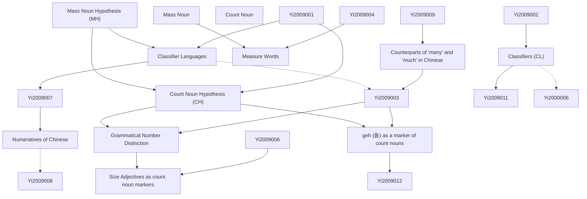

# Zettelkasten 卡片索引

---

## 📚 卡片清單

### 1. [Mass Noun Hypothesis (MH)](zettel_cards/Yi-2009-001.md)
- **ID**: `Yi-2009-001`
- **類型**: 
- **核心**: "Classifier languages have no count nouns. All the common nouns of classifier languages are mass nouns."
- **標籤**: `Mass Noun Hypothesis`, `Classifier Languages`, `Count Noun`

### 2. [Classifier Languages](zettel_cards/Yi-2009-002.md)
- **ID**: `Yi-2009-002`
- **類型**: 
- **核心**: "Such languages, called classifier languages, include Chinese, Japanese, Korean, Thai, and many other East and Southeast Asian languages."
- **標籤**: `Classifier Languages`, `Chinese`, `Japanese`, `Korean`, `Thai`

### 3. [Count Noun Hypothesis (CH)](zettel_cards/Yi-2009-003.md)
- **ID**: `Yi-2009-003`
- **類型**: 
- **核心**: "Classifier languages have count nouns as well as mass nouns. They have morphosyntactic devices for distinguishing count nouns from mass nouns."
- **標籤**: `Count Noun Hypothesis`, `Classifier Languages`, `Count Noun`, `Mass Noun`

### 4. [Mass Noun](zettel_cards/Yi-2009-004.md)
- **ID**: `Yi-2009-004`
- **類型**: 
- **核心**: "The mass noun milk, by contrast, cannot combine with numerals without the aid of measure words, e.g., liter."
- **標籤**: `Mass Noun`, `Count Noun`, `Measure Word`

### 5. [Count Noun](zettel_cards/Yi-2009-005.md)
- **ID**: `Yi-2009-005`
- **類型**: 
- **核心**: "The count noun cow, taking the singular or plural form, can combine directly with numerals."
- **標籤**: `Count Noun`, `Mass Noun`, `Numerals`

### 6. [Grammatical Number Distinction](zettel_cards/Yi-2009-006.md)
- **ID**: `Yi-2009-006`
- **類型**: 
- **核心**: "These languages draw no grammatical number distinction."
- **標籤**: `Grammatical Number`, `Classifier Languages`, `Count Noun`

### 7. [Classifiers (CL)](zettel_cards/Yi-2009-007.md)
- **ID**: `Yi-2009-007`
- **類型**: 
- **核心**: "There are languages that use additional expressions called (numeral) classifiers in their translations of, e.g., (1a), which makes the translations draw a syntactic parallel to their translations of, e.g., (1b)"
- **標籤**: `Classifiers`, `Classifier Languages`, `Count Noun`, `Mass Noun`

### 8. [Measure Words](zettel_cards/Yi-2009-008.md)
- **ID**: `Yi-2009-008`
- **類型**: 
- **核心**: "The mass noun milk, by contrast, cannot combine with numerals without the aid of measure words, e.g., liter."
- **標籤**: `Measure Words`, `Mass Noun`, `Quantity`

### 9. [`geh` (各) as a marker of count nouns](zettel_cards/Yi-2009-009.md)
- **ID**: `Yi-2009-009`
- **類型**: 
- **核心**: "I shall argue that Chinese, like many other classifier languages, has count nouns because it has a counterpart of each (viz., geh 各) that selects count nouns."
- **標籤**: `Count Noun`, `Chinese`, `"geh"`, `Quantifier`

### 10. [Size Adjectives as count noun markers](zettel_cards/Yi-2009-010.md)
- **ID**: `Yi-2009-010`
- **類型**: 
- **核心**: "And size adjectives, as Bunt (1985, p. 199) notes, cannot combine with mass nouns (*big water, for example, is not well-formed)."
- **標籤**: `Count Noun`, `Mass Noun`, `Adjectives`, `Size`

### 11. [Numeratives of Chinese](zettel_cards/Yi-2009-011.md)
- **ID**: `Yi-2009-011`
- **類型**: 
- **核心**: "The crucial point is that among the numeratives of Chinese (or any other classifier language), there is a distinct group that includes those that relate to the notion of individual via the notion of one, and thus pertain only to a special group of nouns that can be called count nouns"
- **標籤**: `Numeratives`, `Classifiers`, `Count Noun`, `Chinese`

### 12. [Counterparts of "many" and "much" in Chinese](zettel_cards/Yi-2009-012.md)
- **ID**: `Yi-2009-012`
- **類型**: 
- **核心**: "henduo ‘a lot’ is the Chinese analogue of many and much. It does not simply amount to much, as the Mass Noun Hypothesis predicts, but has the number/quantity duality, as noted in section 2. That is, it pertains to the number of certain things (e.g., cows) when it combines with count nouns, and to the quantity of some stuff (e.g., meat) when it combines with mass nouns: henduo niu means many cows, but henduo rou means much meat."
- **標籤**: `Chinese`, `"henduo"`, `Many`, `Much`, `Count Noun`, `Mass Noun`

---

## 🗺️ 概念網絡圖

---

## 🏷️ 標籤索引

### Mass Noun Hypothesis
- [[Yi-2009-001]] Mass Noun Hypothesis (MH)

### Classifier Languages
- [[Yi-2009-001]] Mass Noun Hypothesis (MH)
- [[Yi-2009-002]] Classifier Languages
- [[Yi-2009-003]] Count Noun Hypothesis (CH)
- [[Yi-2009-006]] Grammatical Number Distinction
- [[Yi-2009-007]] Classifiers (CL)

### Count Noun
- [[Yi-2009-001]] Mass Noun Hypothesis (MH)
- [[Yi-2009-003]] Count Noun Hypothesis (CH)
- [[Yi-2009-004]] Mass Noun
- [[Yi-2009-005]] Count Noun
- [[Yi-2009-006]] Grammatical Number Distinction
- [[Yi-2009-007]] Classifiers (CL)
- [[Yi-2009-009]] "geh" (各) as a marker of count nouns
- [[Yi-2009-010]] Size Adjectives as count noun markers
- [[Yi-2009-011]] Numeratives of Chinese
- [[Yi-2009-012]] Counterparts of "many" and "much" in Chinese

### Chinese
- [[Yi-2009-002]] Classifier Languages
- [[Yi-2009-009]] "geh" (各) as a marker of count nouns
- [[Yi-2009-011]] Numeratives of Chinese
- [[Yi-2009-012]] Counterparts of "many" and "much" in Chinese

### Japanese
- [[Yi-2009-002]] Classifier Languages

### Korean
- [[Yi-2009-002]] Classifier Languages

### Thai
- [[Yi-2009-002]] Classifier Languages

### Count Noun Hypothesis
- [[Yi-2009-003]] Count Noun Hypothesis (CH)

### Mass Noun
- [[Yi-2009-003]] Count Noun Hypothesis (CH)
- [[Yi-2009-004]] Mass Noun
- [[Yi-2009-005]] Count Noun
- [[Yi-2009-007]] Classifiers (CL)
- [[Yi-2009-008]] Measure Words
- [[Yi-2009-010]] Size Adjectives as count noun markers
- [[Yi-2009-012]] Counterparts of "many" and "much" in Chinese

### Measure Word
- [[Yi-2009-004]] Mass Noun

### Numerals
- [[Yi-2009-005]] Count Noun

### Grammatical Number
- [[Yi-2009-006]] Grammatical Number Distinction

### Classifiers
- [[Yi-2009-007]] Classifiers (CL)
- [[Yi-2009-011]] Numeratives of Chinese

### Measure Words
- [[Yi-2009-008]] Measure Words

### Quantity
- [[Yi-2009-008]] Measure Words

### "geh"
- [[Yi-2009-009]] "geh" (各) as a marker of count nouns

### Quantifier
- [[Yi-2009-009]] "geh" (各) as a marker of count nouns

### Adjectives
- [[Yi-2009-010]] Size Adjectives as count noun markers

### Size
- [[Yi-2009-010]] Size Adjectives as count noun markers

### Numeratives
- [[Yi-2009-011]] Numeratives of Chinese

### "henduo"
- [[Yi-2009-012]] Counterparts of "many" and "much" in Chinese

### Many
- [[Yi-2009-012]] Counterparts of "many" and "much" in Chinese

### Much
- [[Yi-2009-012]] Counterparts of "many" and "much" in Chinese

---

## 📖 閱讀建議順序

1. [[Yi-2009-001]] Mass Noun Hypothesis (MH)

2. [[Yi-2009-002]] Classifier Languages

3. [[Yi-2009-003]] Count Noun Hypothesis (CH)

4. [[Yi-2009-004]] Mass Noun

5. [[Yi-2009-005]] Count Noun

6. [[Yi-2009-006]] Grammatical Number Distinction

7. [[Yi-2009-007]] Classifiers (CL)

8. [[Yi-2009-008]] Measure Words

9. [[Yi-2009-009]] "geh" (各) as a marker of count nouns

10. [[Yi-2009-010]] Size Adjectives as count noun markers

11. [[Yi-2009-011]] Numeratives of Chinese

12. [[Yi-2009-012]] Counterparts of "many" and "much" in Chinese

---

*本索引由 Knowledge Production System 自動生成*