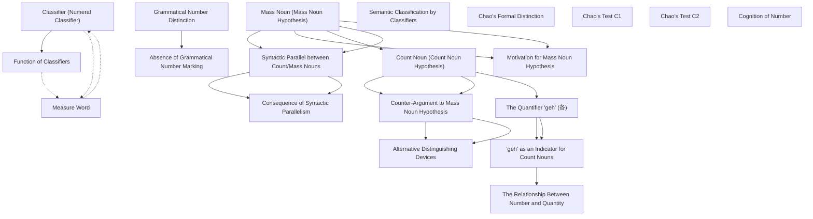

# Zettelkasten 卡片索引

**來源論文**: Yi2009_Chinese_Classifiers_Count_Nouns
**作者**: 
**年份**: 2025
**生成日期**: 2025-10-29 15:48
**卡片總數**: 20

---

## 📚 卡片清單

### 1. [Mass Noun (Mass Noun Hypothesis)](zettel_cards/Linguistics-20251029-001.md)
- **ID**: `Linguistics-20251029-001`
- **類型**: 
- **核心**: "All the common nouns of classifier languages are mass nouns."
- **標籤**: `[Mass Noun]`, `[Classifier Languages]`, `[Noun Classification]`

### 2. [Count Noun (Count Noun Hypothesis)](zettel_cards/Linguistics-20251029-002.md)
- **ID**: `Linguistics-20251029-002`
- **類型**: 
- **核心**: "Classifier languages have count nouns as well as mass nouns."
- **標籤**: `[Count Noun]`, `[Classifier Languages]`, `[Noun Classification]`

### 3. [Classifier (Numeral Classifier)](zettel_cards/Linguistics-20251029-003.md)
- **ID**: `Linguistics-20251029-003`
- **類型**: 
- **核心**: "There are languages that use additional expressions called (numeral) classifiers in their translations of, e.g., (1a), which makes the translations draw a syntactic parallel to their translations of, e.g., (1b)"
- **標籤**: `[Classifier]`, `[Numeral Classifier]`, `[Classifier Languages]`

### 4. [Measure Word](zettel_cards/Linguistics-20251029-004.md)
- **ID**: `Linguistics-20251029-004`
- **類型**: 
- **核心**: "The mass noun milk, by contrast, cannot combine with numerals without the aid of measure words, e.g., liter."
- **標籤**: `[Measure Word]`, `[Mass Noun]`, `[Quantity]`

### 5. [Grammatical Number Distinction](zettel_cards/Linguistics-20251029-005.md)
- **ID**: `Linguistics-20251029-005`
- **類型**: 
- **核心**: "(a) the grammatical number distinction (or the singular-plural morphology)"
- **標籤**: `[Grammatical Number]`, `[Singular]`, `[Plural]`

### 6. [Syntactic Parallel between Count/Mass Nouns](zettel_cards/Linguistics-20251029-006.md)
- **ID**: `Linguistics-20251029-006`
- **類型**: 
- **核心**: "This makes the translations of three cows draw syntactic parallels to the translations of, e.g., three pounds of meat into the same languages"
- **標籤**: `[Syntax]`, `[Count Noun]`, `[Mass Noun]`, `[Parallel Structure]`

### 7. [Motivation for Mass Noun Hypothesis](zettel_cards/Linguistics-20251029-007.md)
- **ID**: `Linguistics-20251029-007`
- **類型**: 
- **核心**: "On their view, all the NNPs of those languages involve classifiers because their nouns, being mass nouns, require measure words to combine with numerals."
- **標籤**: `[Mass Noun Hypothesis]`, `[Classifier]`, `[Noun Phrase]`

### 8. [Counter-Argument to Mass Noun Hypothesis](zettel_cards/Linguistics-20251029-008.md)
- **ID**: `Linguistics-20251029-008`
- **類型**: 
- **核心**: "Languages with all the above-mentioned features might have other devices that one can use to distinguish count nouns from mass nouns."
- **標籤**: `[Count Noun Hypothesis]`, `[Counter-Argument]`, `[Distinction]`

### 9. [Function of Classifiers](zettel_cards/Linguistics-20251029-009.md)
- **ID**: `Linguistics-20251029-009`
- **類型**: 
- **核心**: "They assume that the classifiers in the translations of three cows, like measure words, pertain to the measurement of the quantity of stuff, and conclude that the counterparts of cow are mass nouns."
- **標籤**: `[Classifier]`, `[Measure Word]`, `[Quantity]`, `[Stuff]`

### 10. [Absence of Grammatical Number Marking](zettel_cards/Linguistics-20251029-010.md)
- **ID**: `Linguistics-20251029-010`
- **類型**: 
- **核心**: "(a*) These languages draw no grammatical number distinction."
- **標籤**: `[Grammatical Number]`, `[Classifier Languages]`, `[Absence]`

### 11. [Consequence of Syntactic Parallelism](zettel_cards/Linguistics-20251029-011.md)
- **ID**: `Linguistics-20251029-011`
- **類型**: 
- **核心**: "They argue that this is why those nouns call for the additional items, classifiers, in NNPs, and that it can explain other notable features of classifier languages as well: the grammatical number system, indefinite article, and counterparts of many and few would play no role in languages with no count nouns."
- **標籤**: `[Syntax]`, `[Parallelism]`, `[Classifier]`, `[Nouns]`

### 12. [Alternative Distinguishing Devices](zettel_cards/Linguistics-20251029-012.md)
- **ID**: `Linguistics-20251029-012`
- **類型**: 
- **核心**: "In particular, they might have counterparts of quantifiers listed in (d): each, every, several, etc."
- **標籤**: `[Quantifiers]`, `[Count Noun]`, `[Distinction]`

### 13. [Semantic Classification by Classifiers](zettel_cards/Linguistics-20251029-013.md)
- **ID**: `Linguistics-20251029-013`
- **類型**: 
- **核心**: "Languages with all the above-mentioned features might have other devices that one can use to distinguish count nouns from mass nouns. In particular, they might have counterparts of quantifiers listed in (d): each, every, several, etc."
- **標籤**: `[Classifier]`, `[Semantic]`, `[Classification]`, `[Distinction]`

### 14. [Chao's Formal Distinction](zettel_cards/Linguistics-20251029-014.md)
- **ID**: `Linguistics-20251029-014`
- **類型**: 
- **核心**: "Chao draws a “formal” or syntactic distinction between mass and count nouns of Chinese."
- **標籤**: `[Chao]`, `[Formal Distinction]`, `[Syntax]`, `[Chinese]`

### 15. [Chao's Test C1](zettel_cards/Linguistics-20251029-015.md)
- **ID**: `Linguistics-20251029-015`
- **類型**: 
- **核心**: "(C1) “ Mass nouns do not take the individual classifier” ge, 個 (ibid., p. 508f)."
- **標籤**: `[Chao]`, `[Test C1]`, `[ge]`, `[Classifier]`

### 16. [Chao's Test C2](zettel_cards/Linguistics-20251029-016.md)
- **ID**: `Linguistics-20251029-016`
- **類型**: 
- **核心**: "(C2) Between the numeral phrase of the form Num+CL* and the noun N, “one can insert an optional de for mass nouns but not for individual nouns”, i.e., count nouns (ibid., p. 509)."
- **標籤**: `[Chao]`, `[Test C2]`, `[de]`, `[Noun]`

### 17. [The Quantifier 'geh' (各)](zettel_cards/Linguistics-20251029-017.md)
- **ID**: `Linguistics-20251029-017`
- **類型**: 
- **核心**: "I shall argue that Chinese, like many other classifier lan- guages, has count nouns because it has a counterpart of each (viz., geh 各) that selects count nouns."
- **標籤**: `[Quantifier]`, `[geh]`, `[Chinese]`, `[Count Nouns]`

### 18. ['geh' as an Indicator for Count Nouns](zettel_cards/Linguistics-20251029-018.md)
- **ID**: `Linguistics-20251029-018`
- **類型**: 
- **核心**: "I shall argue that Chinese, like many other classifier lan- guages, has count nouns because it has a counterpart of each (viz., geh 各) that selects count nouns."
- **標籤**: `[geh]`, `[Count Nouns]`, `[Indicator]`

### 19. [The Relationship Between Number and Quantity](zettel_cards/Linguistics-20251029-019.md)
- **ID**: `Linguistics-20251029-019`
- **類型**: 
- **核心**: "The linguistic distinction between mass and count nouns is closely related to the ontological distinction between stuff and individuals, and that between the quantity (i.e., amount) of stuff and number of indi- viduals."
- **標籤**: `[Number]`, `[Quantity]`, `[Mass Noun]`, `[Count Noun]`

### 20. [Cognition of Number](zettel_cards/Linguistics-20251029-020.md)
- **ID**: `Linguistics-20251029-020`
- **類型**: 
- **核心**: "Many studies of animals’ and human infants’ cognition of number suggest that humans conceive individuals and their numbers differently from stuff and its quantity without or before acquiring languages."
- **標籤**: `[Cognition]`, `[Number]`, `[Quantity]`, `[Language Acquisition]`

---

## 🗺️ 概念網絡圖

---

## 🏷️ 標籤索引

### [Mass Noun]
- [[Linguistics-20251029-001]] Mass Noun (Mass Noun Hypothesis)
- [[Linguistics-20251029-004]] Measure Word
- [[Linguistics-20251029-006]] Syntactic Parallel between Count/Mass Nouns
- [[Linguistics-20251029-019]] The Relationship Between Number and Quantity

### [Classifier Languages]
- [[Linguistics-20251029-001]] Mass Noun (Mass Noun Hypothesis)
- [[Linguistics-20251029-002]] Count Noun (Count Noun Hypothesis)
- [[Linguistics-20251029-003]] Classifier (Numeral Classifier)
- [[Linguistics-20251029-010]] Absence of Grammatical Number Marking

### [Noun Classification]
- [[Linguistics-20251029-001]] Mass Noun (Mass Noun Hypothesis)
- [[Linguistics-20251029-002]] Count Noun (Count Noun Hypothesis)

### [Count Noun]
- [[Linguistics-20251029-002]] Count Noun (Count Noun Hypothesis)
- [[Linguistics-20251029-006]] Syntactic Parallel between Count/Mass Nouns
- [[Linguistics-20251029-012]] Alternative Distinguishing Devices
- [[Linguistics-20251029-019]] The Relationship Between Number and Quantity

### [Classifier]
- [[Linguistics-20251029-003]] Classifier (Numeral Classifier)
- [[Linguistics-20251029-007]] Motivation for Mass Noun Hypothesis
- [[Linguistics-20251029-009]] Function of Classifiers
- [[Linguistics-20251029-011]] Consequence of Syntactic Parallelism
- [[Linguistics-20251029-013]] Semantic Classification by Classifiers
- [[Linguistics-20251029-015]] Chao's Test C1

### [Numeral Classifier]
- [[Linguistics-20251029-003]] Classifier (Numeral Classifier)

### [Measure Word]
- [[Linguistics-20251029-004]] Measure Word
- [[Linguistics-20251029-009]] Function of Classifiers

### [Quantity]
- [[Linguistics-20251029-004]] Measure Word
- [[Linguistics-20251029-009]] Function of Classifiers
- [[Linguistics-20251029-019]] The Relationship Between Number and Quantity
- [[Linguistics-20251029-020]] Cognition of Number

### [Grammatical Number]
- [[Linguistics-20251029-005]] Grammatical Number Distinction
- [[Linguistics-20251029-010]] Absence of Grammatical Number Marking

### [Singular]
- [[Linguistics-20251029-005]] Grammatical Number Distinction

### [Plural]
- [[Linguistics-20251029-005]] Grammatical Number Distinction

### [Syntax]
- [[Linguistics-20251029-006]] Syntactic Parallel between Count/Mass Nouns
- [[Linguistics-20251029-011]] Consequence of Syntactic Parallelism
- [[Linguistics-20251029-014]] Chao's Formal Distinction

### [Parallel Structure]
- [[Linguistics-20251029-006]] Syntactic Parallel between Count/Mass Nouns

### [Mass Noun Hypothesis]
- [[Linguistics-20251029-007]] Motivation for Mass Noun Hypothesis

### [Noun Phrase]
- [[Linguistics-20251029-007]] Motivation for Mass Noun Hypothesis

### [Count Noun Hypothesis]
- [[Linguistics-20251029-008]] Counter-Argument to Mass Noun Hypothesis

### [Counter-Argument]
- [[Linguistics-20251029-008]] Counter-Argument to Mass Noun Hypothesis

### [Distinction]
- [[Linguistics-20251029-008]] Counter-Argument to Mass Noun Hypothesis
- [[Linguistics-20251029-012]] Alternative Distinguishing Devices
- [[Linguistics-20251029-013]] Semantic Classification by Classifiers

### [Stuff]
- [[Linguistics-20251029-009]] Function of Classifiers

### [Absence]
- [[Linguistics-20251029-010]] Absence of Grammatical Number Marking

### [Parallelism]
- [[Linguistics-20251029-011]] Consequence of Syntactic Parallelism

### [Nouns]
- [[Linguistics-20251029-011]] Consequence of Syntactic Parallelism

### [Quantifiers]
- [[Linguistics-20251029-012]] Alternative Distinguishing Devices

### [Semantic]
- [[Linguistics-20251029-013]] Semantic Classification by Classifiers

### [Classification]
- [[Linguistics-20251029-013]] Semantic Classification by Classifiers

### [Chao]
- [[Linguistics-20251029-014]] Chao's Formal Distinction
- [[Linguistics-20251029-015]] Chao's Test C1
- [[Linguistics-20251029-016]] Chao's Test C2

### [Formal Distinction]
- [[Linguistics-20251029-014]] Chao's Formal Distinction

### [Chinese]
- [[Linguistics-20251029-014]] Chao's Formal Distinction
- [[Linguistics-20251029-017]] The Quantifier 'geh' (各)

### [Test C1]
- [[Linguistics-20251029-015]] Chao's Test C1

### [ge]
- [[Linguistics-20251029-015]] Chao's Test C1

### [Test C2]
- [[Linguistics-20251029-016]] Chao's Test C2

### [de]
- [[Linguistics-20251029-016]] Chao's Test C2

### [Noun]
- [[Linguistics-20251029-016]] Chao's Test C2

### [Quantifier]
- [[Linguistics-20251029-017]] The Quantifier 'geh' (各)

### [geh]
- [[Linguistics-20251029-017]] The Quantifier 'geh' (各)
- [[Linguistics-20251029-018]] 'geh' as an Indicator for Count Nouns

### [Count Nouns]
- [[Linguistics-20251029-017]] The Quantifier 'geh' (各)
- [[Linguistics-20251029-018]] 'geh' as an Indicator for Count Nouns

### [Indicator]
- [[Linguistics-20251029-018]] 'geh' as an Indicator for Count Nouns

### [Number]
- [[Linguistics-20251029-019]] The Relationship Between Number and Quantity
- [[Linguistics-20251029-020]] Cognition of Number

### [Cognition]
- [[Linguistics-20251029-020]] Cognition of Number

### [Language Acquisition]
- [[Linguistics-20251029-020]] Cognition of Number

---

## 📖 閱讀建議順序

1. [[Linguistics-20251029-003]] Classifier (Numeral Classifier)

2. [[Linguistics-20251029-004]] Measure Word

3. [[Linguistics-20251029-007]] Motivation for Mass Noun Hypothesis

4. [[Linguistics-20251029-009]] Function of Classifiers

5. [[Linguistics-20251029-010]] Absence of Grammatical Number Marking

6. [[Linguistics-20251029-011]] Consequence of Syntactic Parallelism

7. [[Linguistics-20251029-012]] Alternative Distinguishing Devices

8. [[Linguistics-20251029-013]] Semantic Classification by Classifiers

9. [[Linguistics-20251029-014]] Chao's Formal Distinction

10. [[Linguistics-20251029-015]] Chao's Test C1

11. [[Linguistics-20251029-016]] Chao's Test C2

12. [[Linguistics-20251029-018]] 'geh' as an Indicator for Count Nouns

13. [[Linguistics-20251029-019]] The Relationship Between Number and Quantity

14. [[Linguistics-20251029-020]] Cognition of Number

15. [[Linguistics-20251029-005]] Grammatical Number Distinction

16. [[Linguistics-20251029-006]] Syntactic Parallel between Count/Mass Nouns

17. [[Linguistics-20251029-008]] Counter-Argument to Mass Noun Hypothesis

18. [[Linguistics-20251029-017]] The Quantifier 'geh' (各)

19. [[Linguistics-20251029-002]] Count Noun (Count Noun Hypothesis)

20. [[Linguistics-20251029-001]] Mass Noun (Mass Noun Hypothesis)

---

*本索引由 Knowledge Production System 自動生成*