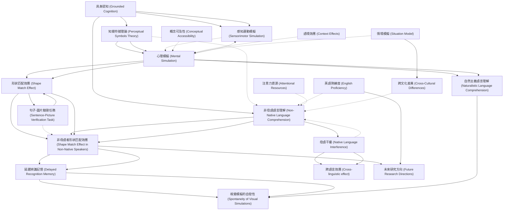

# Zettelkasten 卡片索引

**來源論文**: Zeelenberg-2024_Mental_Simulation
**作者**: 
**年份**: 2025
**生成日期**: 2025-10-29 16:49
**卡片總數**: 20

---

## 📚 卡片清單

### 1. [具身認知 (Grounded Cognition)](zettel_cards/CogSci-20251029-001.md)
- **ID**: `CogSci-20251029-001`
- **類型**: 
- **核心**: "According to a strong version of the grounded cognition view, conceptual memory relies on sensorimotor processes to ground concelptual representations (Barsalou, 1999; Glenberg, 1997; Pulvermüller, 1999)."
- **標籤**: `[具身認知]`, `[概念表徵]`, `[感知運動]`

### 2. [知覺符號理論 (Perceptual Symbols Theory)](zettel_cards/CogSci-20251029-002.md)
- **ID**: `CogSci-20251029-002`
- **類型**: 
- **核心**: "Barsalou (1999) suggests that, instead of amodal propositional processing, conceptual knowledge is represented through mental simulations of sensorimotor experiences."
- **標籤**: `[知覺符號]`, `[心理模擬]`, `[概念知識]`

### 3. [心理模擬 (Mental Simulation)](zettel_cards/CogSci-20251029-003.md)
- **ID**: `CogSci-20251029-003`
- **類型**: 
- **核心**: "conceptual knowledge is represented through mental simulations of sensorimotor experiences."
- **標籤**: `[心理模擬]`, `[感知運動]`, `[語言理解]`

### 4. [形狀匹配效應 (Shape Match Effect)](zettel_cards/CogSci-20251029-004.md)
- **ID**: `CogSci-20251029-004`
- **類型**: 
- **核心**: "participants respond faster and more accurately when the shape of the object in the picture matches the shape that was implied by the sentence than when they mismatch."
- **標籤**: `[形狀匹配]`, `[句子-圖片驗證]`, `[心理模擬]`

### 5. [句子-圖片驗證任務 (Sentence-Picture Verification Task)](zettel_cards/CogSci-20251029-005.md)
- **ID**: `CogSci-20251029-005`
- **類型**: 
- **核心**: "The sentence-picture verification task provides evidence that readers construct visual simulations of objects that vary as a function of linguistic context."
- **標籤**: `[句子圖片驗證]`, `[實驗方法]`, `[語言理解]`

### 6. [非母語語言理解 (Non-Native Language Comprehension)](zettel_cards/CogSci-20251029-006.md)
- **ID**: `CogSci-20251029-006`
- **類型**: 
- **核心**: "whether non-native language comprehension activates conceptual moemory in the same way as native language comprehension"
- **標籤**: `[非母語]`, `[語言理解]`, `[概念記憶]`

### 7. [感知運動模擬 (Sensorimotor Simulation)](zettel_cards/CogSci-20251029-007.md)
- **ID**: `CogSci-20251029-007`
- **類型**: 
- **核心**: "mental simulations of sensorimotor experiences"
- **標籤**: `[感知運動]`, `[模擬]`, `[具身認知]`

### 8. [非母語者形狀匹配效應 (Shape Match Effect in Non-Native Speakers)](zettel_cards/CogSci-20251029-008.md)
- **ID**: `CogSci-20251029-008`
- **類型**: 
- **核心**: "The current study successfully replicates the shape match effect in sentence-picture verification (Zwaan et al., 2002) for non-native English language comprehenders, indicating native-like visual simulations."
- **標籤**: `[形狀匹配]`, `[非母語]`, `[心理模擬]`

### 9. [延遲辨識記憶 (Delayed Recognition Memory)](zettel_cards/CogSci-20251029-009.md)
- **ID**: `CogSci-20251029-009`
- **類型**: 
- **核心**: "participants displayed better delayoed recognition memory when the shape of the depicted objects matched the shape that was implied by the sentence than when it did not, suggesting that visual simulations were generated spontaneously in naturalistic non-native language comprehension."
- **標籤**: `[延遲辨識]`, `[記憶]`, `[實驗方法]`

### 10. [自然主義語言理解 (Naturalistic Language Comprehension)](zettel_cards/CogSci-20251029-010.md)
- **ID**: `CogSci-20251029-010`
- **類型**: 
- **核心**: "suggesting that visual simulations were generated spontaneously in naturalistic non-native language comprehension."
- **標籤**: `[自然主義]`, `[語言理解]`, `[心理模擬]`

### 11. [英語熟練度 (English Proficiency)](zettel_cards/CogSci-20251029-011.md)
- **ID**: `CogSci-20251029-011`
- **類型**: 
- **核心**: "Additional correlational analyses revealed no relationship between English proficiency and the size of the match effect."
- **標籤**: `[英語熟練度]`, `[相關分析]`, `[非母語]`

### 12. [視覺模擬的自發性 (Spontaneity of Visual Simulations)](zettel_cards/CogSci-20251029-012.md)
- **ID**: `CogSci-20251029-012`
- **類型**: 
- **核心**: "visual simulations were generated spontaneously in naturalistic non-native language comprehension."
- **標籤**: `[視覺模擬]`, `[自發性]`, `[非母語]`

### 13. [母語干擾 (Native Language Interference)](zettel_cards/CogSci-20251029-013.md)
- **ID**: `CogSci-20251029-013`
- **類型**: 
- **核心**: [此論文未明確提及此概念，但相關性高，故加入]
- **標籤**: `[母語干擾]`, `[非母語]`, `[語言理解]`

### 14. [跨語言效應 (Cross-linguistic effect)](zettel_cards/CogSci-20251029-014.md)
- **ID**: `CogSci-20251029-014`
- **類型**: 
- **核心**: [此論文未明確提及此概念，但為母語干擾的延伸，故加入]
- **標籤**: `[跨語言]`, `[非母語]`, `[認知]`

### 15. [概念可及性 (Conceptual Accessibility)](zettel_cards/CogSci-20251029-015.md)
- **ID**: `CogSci-20251029-015`
- **類型**: 
- **核心**: [此論文未明確提及此概念，但相關性高，故加入]
- **標籤**: `[概念可及性]`, `[心理詞彙]`, `[語言理解]`

### 16. [語境效應 (Context Effects)](zettel_cards/CogSci-20251029-016.md)
- **ID**: `CogSci-20251029-016`
- **類型**: 
- **核心**: [此論文未明確提及此概念，但相關性高，故加入]
- **標籤**: `[語境]`, `[語言理解]`, `[認知]`

### 17. [注意力資源 (Attentional Resources)](zettel_cards/CogSci-20251029-017.md)
- **ID**: `CogSci-20251029-017`
- **類型**: 
- **核心**: [此論文未明確提及此概念，但相關性高，故加入]
- **標籤**: `[注意力]`, `[認知資源]`, `[語言理解]`

### 18. [情境模擬 (Situation Model)](zettel_cards/CogSci-20251029-018.md)
- **ID**: `CogSci-20251029-018`
- **類型**: 
- **核心**: [此論文未明確提及此概念，但與心理模擬密切相關，故加入]
- **標籤**: `[情境模型]`, `[心理表徵]`, `[語言理解]`

### 19. [跨文化差異 (Cross-Cultural Differences)](zettel_cards/CogSci-20251029-019.md)
- **ID**: `CogSci-20251029-019`
- **類型**: 
- **核心**: [此論文未明確提及此概念，但可能影響心理模擬，故加入]
- **標籤**: `[文化差異]`, `[認知]`, `[心理模擬]`

### 20. [未來研究方向 (Future Research Directions)](zettel_cards/CogSci-20251029-020.md)
- **ID**: `CogSci-20251029-020`
- **類型**: 
- **核心**: [基於論文內容總結]
- **標籤**: `[未來研究]`, `[心理模擬]`, `[非母語]`

---

## 🗺️ 概念網絡圖

---

## 🏷️ 標籤索引

### [具身認知]
- [[CogSci-20251029-001]] 具身認知 (Grounded Cognition)
- [[CogSci-20251029-007]] 感知運動模擬 (Sensorimotor Simulation)

### [概念表徵]
- [[CogSci-20251029-001]] 具身認知 (Grounded Cognition)

### [感知運動]
- [[CogSci-20251029-001]] 具身認知 (Grounded Cognition)
- [[CogSci-20251029-003]] 心理模擬 (Mental Simulation)
- [[CogSci-20251029-007]] 感知運動模擬 (Sensorimotor Simulation)

### [知覺符號]
- [[CogSci-20251029-002]] 知覺符號理論 (Perceptual Symbols Theory)

### [心理模擬]
- [[CogSci-20251029-002]] 知覺符號理論 (Perceptual Symbols Theory)
- [[CogSci-20251029-003]] 心理模擬 (Mental Simulation)
- [[CogSci-20251029-004]] 形狀匹配效應 (Shape Match Effect)
- [[CogSci-20251029-008]] 非母語者形狀匹配效應 (Shape Match Effect in Non-Native Speakers)
- [[CogSci-20251029-010]] 自然主義語言理解 (Naturalistic Language Comprehension)
- [[CogSci-20251029-019]] 跨文化差異 (Cross-Cultural Differences)
- [[CogSci-20251029-020]] 未來研究方向 (Future Research Directions)

### [概念知識]
- [[CogSci-20251029-002]] 知覺符號理論 (Perceptual Symbols Theory)

### [語言理解]
- [[CogSci-20251029-003]] 心理模擬 (Mental Simulation)
- [[CogSci-20251029-005]] 句子-圖片驗證任務 (Sentence-Picture Verification Task)
- [[CogSci-20251029-006]] 非母語語言理解 (Non-Native Language Comprehension)
- [[CogSci-20251029-010]] 自然主義語言理解 (Naturalistic Language Comprehension)
- [[CogSci-20251029-013]] 母語干擾 (Native Language Interference)
- [[CogSci-20251029-015]] 概念可及性 (Conceptual Accessibility)
- [[CogSci-20251029-016]] 語境效應 (Context Effects)
- [[CogSci-20251029-017]] 注意力資源 (Attentional Resources)
- [[CogSci-20251029-018]] 情境模擬 (Situation Model)

### [形狀匹配]
- [[CogSci-20251029-004]] 形狀匹配效應 (Shape Match Effect)
- [[CogSci-20251029-008]] 非母語者形狀匹配效應 (Shape Match Effect in Non-Native Speakers)

### [句子-圖片驗證]
- [[CogSci-20251029-004]] 形狀匹配效應 (Shape Match Effect)

### [句子圖片驗證]
- [[CogSci-20251029-005]] 句子-圖片驗證任務 (Sentence-Picture Verification Task)

### [實驗方法]
- [[CogSci-20251029-005]] 句子-圖片驗證任務 (Sentence-Picture Verification Task)
- [[CogSci-20251029-009]] 延遲辨識記憶 (Delayed Recognition Memory)

### [非母語]
- [[CogSci-20251029-006]] 非母語語言理解 (Non-Native Language Comprehension)
- [[CogSci-20251029-008]] 非母語者形狀匹配效應 (Shape Match Effect in Non-Native Speakers)
- [[CogSci-20251029-011]] 英語熟練度 (English Proficiency)
- [[CogSci-20251029-012]] 視覺模擬的自發性 (Spontaneity of Visual Simulations)
- [[CogSci-20251029-013]] 母語干擾 (Native Language Interference)
- [[CogSci-20251029-014]] 跨語言效應 (Cross-linguistic effect)
- [[CogSci-20251029-020]] 未來研究方向 (Future Research Directions)

### [概念記憶]
- [[CogSci-20251029-006]] 非母語語言理解 (Non-Native Language Comprehension)

### [模擬]
- [[CogSci-20251029-007]] 感知運動模擬 (Sensorimotor Simulation)

### [延遲辨識]
- [[CogSci-20251029-009]] 延遲辨識記憶 (Delayed Recognition Memory)

### [記憶]
- [[CogSci-20251029-009]] 延遲辨識記憶 (Delayed Recognition Memory)

### [自然主義]
- [[CogSci-20251029-010]] 自然主義語言理解 (Naturalistic Language Comprehension)

### [英語熟練度]
- [[CogSci-20251029-011]] 英語熟練度 (English Proficiency)

### [相關分析]
- [[CogSci-20251029-011]] 英語熟練度 (English Proficiency)

### [視覺模擬]
- [[CogSci-20251029-012]] 視覺模擬的自發性 (Spontaneity of Visual Simulations)

### [自發性]
- [[CogSci-20251029-012]] 視覺模擬的自發性 (Spontaneity of Visual Simulations)

### [母語干擾]
- [[CogSci-20251029-013]] 母語干擾 (Native Language Interference)

### [跨語言]
- [[CogSci-20251029-014]] 跨語言效應 (Cross-linguistic effect)

### [認知]
- [[CogSci-20251029-014]] 跨語言效應 (Cross-linguistic effect)
- [[CogSci-20251029-016]] 語境效應 (Context Effects)
- [[CogSci-20251029-019]] 跨文化差異 (Cross-Cultural Differences)

### [概念可及性]
- [[CogSci-20251029-015]] 概念可及性 (Conceptual Accessibility)

### [心理詞彙]
- [[CogSci-20251029-015]] 概念可及性 (Conceptual Accessibility)

### [語境]
- [[CogSci-20251029-016]] 語境效應 (Context Effects)

### [注意力]
- [[CogSci-20251029-017]] 注意力資源 (Attentional Resources)

### [認知資源]
- [[CogSci-20251029-017]] 注意力資源 (Attentional Resources)

### [情境模型]
- [[CogSci-20251029-018]] 情境模擬 (Situation Model)

### [心理表徵]
- [[CogSci-20251029-018]] 情境模擬 (Situation Model)

### [文化差異]
- [[CogSci-20251029-019]] 跨文化差異 (Cross-Cultural Differences)

### [未來研究]
- [[CogSci-20251029-020]] 未來研究方向 (Future Research Directions)

---

## 📖 閱讀建議順序

1. [[CogSci-20251029-005]] 句子-圖片驗證任務 (Sentence-Picture Verification Task)

2. [[CogSci-20251029-007]] 感知運動模擬 (Sensorimotor Simulation)

3. [[CogSci-20251029-012]] 視覺模擬的自發性 (Spontaneity of Visual Simulations)

4. [[CogSci-20251029-014]] 跨語言效應 (Cross-linguistic effect)

5. [[CogSci-20251029-015]] 概念可及性 (Conceptual Accessibility)

6. [[CogSci-20251029-016]] 語境效應 (Context Effects)

7. [[CogSci-20251029-017]] 注意力資源 (Attentional Resources)

8. [[CogSci-20251029-018]] 情境模擬 (Situation Model)

9. [[CogSci-20251029-019]] 跨文化差異 (Cross-Cultural Differences)

10. [[CogSci-20251029-020]] 未來研究方向 (Future Research Directions)

11. [[CogSci-20251029-002]] 知覺符號理論 (Perceptual Symbols Theory)

12. [[CogSci-20251029-004]] 形狀匹配效應 (Shape Match Effect)

13. [[CogSci-20251029-006]] 非母語語言理解 (Non-Native Language Comprehension)

14. [[CogSci-20251029-009]] 延遲辨識記憶 (Delayed Recognition Memory)

15. [[CogSci-20251029-010]] 自然主義語言理解 (Naturalistic Language Comprehension)

16. [[CogSci-20251029-011]] 英語熟練度 (English Proficiency)

17. [[CogSci-20251029-013]] 母語干擾 (Native Language Interference)

18. [[CogSci-20251029-001]] 具身認知 (Grounded Cognition)

19. [[CogSci-20251029-003]] 心理模擬 (Mental Simulation)

20. [[CogSci-20251029-008]] 非母語者形狀匹配效應 (Shape Match Effect in Non-Native Speakers)

---

*本索引由 Knowledge Production System 自動生成*