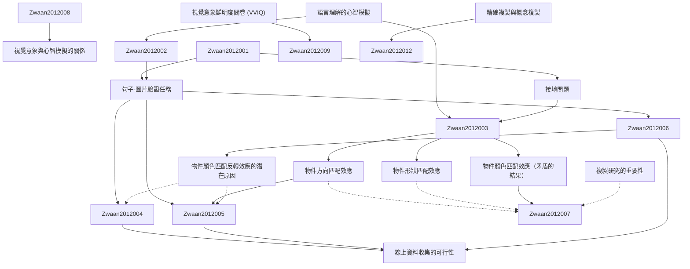

# Zettelkasten 卡片索引

---

## 📚 卡片清單

### 1. [語言理解的心智模擬](zettel_cards/Zwaan-2012-001.md)
- **ID**: `Zwaan-2012-001`
- **類型**: 
- **核心**: "Thenotionoflanguagecomprehensionasmentalsimulationhasbecomepopularincognitivescience."
- **標籤**: `[語言理解]`, `[心智模擬]`, `[認知科學]`

### 2. [接地問題](zettel_cards/Zwaan-2012-002.md)
- **ID**: `Zwaan-2012-002`
- **類型**: 
- **核心**: "Abstract, amodal, and arbitrary symbolshavenoconnectiontoactualexperience;theyarefloatingfreeinsomementaletherandarethereforeessentiallymeaningless."
- **標籤**: `[接地問題]`, `[符號]`, `[經驗]`

### 3. [句子-圖片驗證任務](zettel_cards/Zwaan-2012-003.md)
- **ID**: `Zwaan-2012-003`
- **類型**: 
- **核心**: "Participants read a sentence in which the orientation of an object is implied, rather than stated explicitly, and then they decide whether the object shown in the subsequently presented picture was mentioned in the sentence."
- **標籤**: `[句子-圖片驗證]`, `[實驗方法]`, `[反應時間]`

### 4. [物件方向匹配效應](zettel_cards/Zwaan-2012-004.md)
- **ID**: `Zwaan-2012-004`
- **類型**: 
- **核心**: "Participants were faster to verify pictures that matched the implied orientation than pictures that mismatched [4]."
- **標籤**: `[物件方向]`, `[匹配效應]`, `[反應時間]`

### 5. [物件形狀匹配效應](zettel_cards/Zwaan-2012-005.md)
- **ID**: `Zwaan-2012-005`
- **類型**: 
- **核心**: "A significant match effect was obtained, which appeared more robust than the orientation effect, as indicatedby theeffectsizes inTable1."
- **標籤**: `[物件形狀]`, `[匹配效應]`, `[反應時間]`

### 6. [物件顏色匹配效應（矛盾的結果）](zettel_cards/Zwaan-2012-006.md)
- **ID**: `Zwaan-2012-006`
- **類型**: 
- **核心**: "Connell obtained faster picture verification responses when the color mismatched than when it matched."
- **標籤**: `[物件顏色]`, `[匹配效應]`, `[反應時間]`

### 7. [線上資料收集的可行性](zettel_cards/Zwaan-2012-007.md)
- **ID**: `Zwaan-2012-007`
- **類型**: 
- **核心**: "Wearguethattheseresultssupportmentalsimulationtheory,showtheimportanceofreplicationstudies,andshowtheviabilityofweb-baseddatacollection."
- **標籤**: `[線上實驗]`, `[Mechanical Turk]`, `[複製研究]`

### 8. [視覺意象鮮明度問卷 (VVIQ)](zettel_cards/Zwaan-2012-008.md)
- **ID**: `Zwaan-2012-008`
- **類型**: 
- **核心**: "An adapted version of the Vividness of Visual Imagery Questionnaire(VVIQ[33])wasused."
- **標籤**: `[VVIQ]`, `[視覺意象]`, `[問卷]`

### 9. [視覺意象與心智模擬的關係](zettel_cards/Zwaan-2012-009.md)
- **ID**: `Zwaan-2012-009`
- **類型**: 
- **核心**: "Although imagery ability and imagery preference are related to cognitive processes if they involve similar operations [31],[32],[33],[34], some studies have found no relation between imagery ability and effect size in paradigmsthatinvestigatedmentalsimulations[4],[35]."
- **標籤**: `[視覺意象]`, `[心智模擬]`, `[個體差異]`

### 10. [複製研究的重要性](zettel_cards/Zwaan-2012-010.md)
- **ID**: `Zwaan-2012-010`
- **類型**: 
- **核心**: "Our aim here is to examine part of the firmness of the empirical base for mental simulation in language comprehension."
- **標籤**: `[複製研究]`, `[實證基礎]`, `[語言理解]`

### 11. [精確複製與概念複製](zettel_cards/Zwaan-2012-011.md)
- **ID**: `Zwaan-2012-011`
- **類型**: 
- **核心**: "One can think of exact and conceptual replications as being on a continuum, where by one endpoint (‘‘exact’’) can only be approximated."
- **標籤**: `[精確複製]`, `[概念複製]`, `[研究方法]`

### 12. [物件顏色匹配反轉效應的潛在原因](zettel_cards/Zwaan-2012-012.md)
- **ID**: `Zwaan-2012-012`
- **類型**: 
- **核心**: "It is puzzling that the effect of color is the reverse of that of orientation and shape."
- **標籤**: `[顏色]`, `[反轉效應]`, `[心智模擬]`

---

## 🗺️ 概念網絡圖

---

## 🏷️ 標籤索引

### [語言理解]
- [[Zwaan-2012-001]] 語言理解的心智模擬
- [[Zwaan-2012-010]] 複製研究的重要性

### [心智模擬]
- [[Zwaan-2012-001]] 語言理解的心智模擬
- [[Zwaan-2012-009]] 視覺意象與心智模擬的關係
- [[Zwaan-2012-012]] 物件顏色匹配反轉效應的潛在原因

### [認知科學]
- [[Zwaan-2012-001]] 語言理解的心智模擬

### [接地問題]
- [[Zwaan-2012-002]] 接地問題

### [符號]
- [[Zwaan-2012-002]] 接地問題

### [經驗]
- [[Zwaan-2012-002]] 接地問題

### [句子-圖片驗證]
- [[Zwaan-2012-003]] 句子-圖片驗證任務

### [實驗方法]
- [[Zwaan-2012-003]] 句子-圖片驗證任務

### [反應時間]
- [[Zwaan-2012-003]] 句子-圖片驗證任務
- [[Zwaan-2012-004]] 物件方向匹配效應
- [[Zwaan-2012-005]] 物件形狀匹配效應
- [[Zwaan-2012-006]] 物件顏色匹配效應（矛盾的結果）

### [物件方向]
- [[Zwaan-2012-004]] 物件方向匹配效應

### [匹配效應]
- [[Zwaan-2012-004]] 物件方向匹配效應
- [[Zwaan-2012-005]] 物件形狀匹配效應
- [[Zwaan-2012-006]] 物件顏色匹配效應（矛盾的結果）

### [物件形狀]
- [[Zwaan-2012-005]] 物件形狀匹配效應

### [物件顏色]
- [[Zwaan-2012-006]] 物件顏色匹配效應（矛盾的結果）

### [線上實驗]
- [[Zwaan-2012-007]] 線上資料收集的可行性

### [Mechanical Turk]
- [[Zwaan-2012-007]] 線上資料收集的可行性

### [複製研究]
- [[Zwaan-2012-007]] 線上資料收集的可行性
- [[Zwaan-2012-010]] 複製研究的重要性

### [VVIQ]
- [[Zwaan-2012-008]] 視覺意象鮮明度問卷 (VVIQ)

### [視覺意象]
- [[Zwaan-2012-008]] 視覺意象鮮明度問卷 (VVIQ)
- [[Zwaan-2012-009]] 視覺意象與心智模擬的關係

### [問卷]
- [[Zwaan-2012-008]] 視覺意象鮮明度問卷 (VVIQ)

### [個體差異]
- [[Zwaan-2012-009]] 視覺意象與心智模擬的關係

### [實證基礎]
- [[Zwaan-2012-010]] 複製研究的重要性

### [精確複製]
- [[Zwaan-2012-011]] 精確複製與概念複製

### [概念複製]
- [[Zwaan-2012-011]] 精確複製與概念複製

### [研究方法]
- [[Zwaan-2012-011]] 精確複製與概念複製

### [顏色]
- [[Zwaan-2012-012]] 物件顏色匹配反轉效應的潛在原因

### [反轉效應]
- [[Zwaan-2012-012]] 物件顏色匹配反轉效應的潛在原因

---

## 📖 閱讀建議順序

1. [[Zwaan-2012-001]] 語言理解的心智模擬

2. [[Zwaan-2012-002]] 接地問題

3. [[Zwaan-2012-003]] 句子-圖片驗證任務

4. [[Zwaan-2012-004]] 物件方向匹配效應

5. [[Zwaan-2012-005]] 物件形狀匹配效應

6. [[Zwaan-2012-006]] 物件顏色匹配效應（矛盾的結果）

7. [[Zwaan-2012-007]] 線上資料收集的可行性

8. [[Zwaan-2012-008]] 視覺意象鮮明度問卷 (VVIQ)

9. [[Zwaan-2012-009]] 視覺意象與心智模擬的關係

10. [[Zwaan-2012-010]] 複製研究的重要性

11. [[Zwaan-2012-011]] 精確複製與概念複製

12. [[Zwaan-2012-012]] 物件顏色匹配反轉效應的潛在原因

---

*本索引由 Knowledge Production System 自動生成*