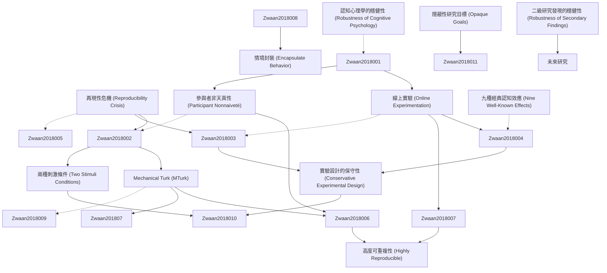

# Zettelkasten 卡片索引

---

## 📚 卡片清單

### 1. [再現性危機 (Reproducibility Crisis)](zettel_cards/Zwaan-2018-001.md)
- **ID**: `Zwaan-2018-001`
- **類型**: 
- **核心**: "Many argue that there is a reproducibility crisis in psychology."
- **標籤**: `再現性`, `心理學`, `科學方法`

### 2. [線上實驗 (Online Experimentation)](zettel_cards/Zwaan-2018-002.md)
- **ID**: `Zwaan-2018-002`
- **類型**: 
- **核心**: "Coincident with the start of the reproducibility debate was the advent of online experimentation."
- **標籤**: `線上實驗`, `Mechanical Turk`, `研究方法`

### 3. [參與者非天真性 (Participant Nonnaiveté)](zettel_cards/Zwaan-2018-003.md)
- **ID**: `Zwaan-2018-003`
- **類型**: 
- **核心**: "Of particular concern for reproducibility, participants may participate in studies in which they have participated before."
- **標籤**: `參與者效應`, `重複參與`, `研究偏誤`

### 4. [Mechanical Turk (MTurk)](zettel_cards/Zwaan-2018-004.md)
- **ID**: `Zwaan-2018-004`
- **類型**: 
- **核心**: "Crowd-sourcing websites, such as Amazon Mechanical Turk, offered the prospect of more efficient, powerful, and generalizable ways of testing psychological theories"
- **標籤**: `線上平台`, `群眾外包`, `參與者招募`

### 5. [認知心理學的穩健性 (Robustness of Cognitive Psychology)](zettel_cards/Zwaan-2018-005.md)
- **ID**: `Zwaan-2018-005`
- **類型**: 
- **核心**: "Although concerns with reproducibility span the entire field of psychology and beyond, results in cognitive psychology are typically conceived as comparatively robust."
- **標籤**: `認知心理學`, `再現性`, `穩健性`

### 6. [實驗設計的保守性 (Conservative Experimental Design)](zettel_cards/Zwaan-2018-006.md)
- **ID**: `Zwaan-2018-006`
- **類型**: 
- **核心**: "Wetestedthishypothesisbyreplicatingeachstudyinthemostconservativecase—inwhichallparticipantsencounteredthestudybefore."
- **標籤**: `實驗設計`, `複製研究`, `保守策略`

### 7. [兩種刺激條件 (Two Stimuli Conditions)](zettel_cards/Zwaan-2018-007.md)
- **ID**: `Zwaan-2018-007`
- **類型**: 
- **核心**: "Inthesecondwave,halfofthesubjectsparticipatedinanexactcopyoftheexperimenttheyhadparticipatedinbefore;theotherhalfparticipatedinaversionthathadanidenticalinstructionandprocedurebutusedifferentstimuli."
- **標籤**: `實驗變異`, `刺激材料`, `條件控制`

### 8. [隱蔽性研究目標 (Opaque Goals)](zettel_cards/Zwaan-2018-008.md)
- **ID**: `Zwaan-2018-008`
- **類型**: 
- **核心**: "However, studies in cognitive psychology typically have nontransparent research goals, making memory of previous experiences irrelevant."
- **標籤**: `實驗目標`, `研究設計`, `參與者行為`

### 9. [九種經典認知效應 (Nine Well-Known Effects)](zettel_cards/Zwaan-2018-009.md)
- **ID**: `Zwaan-2018-009`
- **類型**: 
- **核心**: "We investigated nine well-known effects from the cognitive psychology literature—three each from the domains of perception/action, memory, and language, respectively—and found that they are highly reproducible."
- **標籤**: `認知效應`, `再現性`, `經典研究`

### 10. [高度可重複性 (Highly Reproducible)](zettel_cards/Zwaan-2018-010.md)
- **ID**: `Zwaan-2018-010`
- **類型**: 
- **核心**: "foundthattheyarehighlyreproducible.Notonlycantheybereproducedinonlineenvironments,buttheyalsocanbereproducedwithnonnaïveparticipantswithnoreductionofeffectsize."
- **標籤**: `實驗結果`, `線上研究`, `參與者經驗`

### 11. [情境封裝 (Encapsulate Behavior)](zettel_cards/Zwaan-2018-011.md)
- **ID**: `Zwaan-2018-011`
- **類型**: 
- **核心**: "Apparently, some cognitive tasks are so constraining that they encapsulate behavior from external influences, such as testing situation and prior recent experience with the experiment to yield highly robust effects."
- **標籤**: `認知任務`, `情境影響`, `行為控制`

### 12. [二級研究發現的穩健性 (Robustness of Secondary Findings)](zettel_cards/Zwaan-2018-012.md)
- **ID**: `Zwaan-2018-012`
- **類型**: 
- **核心**: "The jury is still out on whether such secondary findings are as robust as the more basic findings we have presented here."
- **標籤**: `研究方向`, `穩健性`, `實驗變異`

---

## 🗺️ 概念網絡圖

---

## 🏷️ 標籤索引

### 再現性
- [[Zwaan-2018-001]] 再現性危機 (Reproducibility Crisis)
- [[Zwaan-2018-005]] 認知心理學的穩健性 (Robustness of Cognitive Psychology)
- [[Zwaan-2018-009]] 九種經典認知效應 (Nine Well-Known Effects)

### 心理學
- [[Zwaan-2018-001]] 再現性危機 (Reproducibility Crisis)

### 科學方法
- [[Zwaan-2018-001]] 再現性危機 (Reproducibility Crisis)

### 線上實驗
- [[Zwaan-2018-002]] 線上實驗 (Online Experimentation)

### Mechanical Turk
- [[Zwaan-2018-002]] 線上實驗 (Online Experimentation)

### 研究方法
- [[Zwaan-2018-002]] 線上實驗 (Online Experimentation)

### 參與者效應
- [[Zwaan-2018-003]] 參與者非天真性 (Participant Nonnaiveté)

### 重複參與
- [[Zwaan-2018-003]] 參與者非天真性 (Participant Nonnaiveté)

### 研究偏誤
- [[Zwaan-2018-003]] 參與者非天真性 (Participant Nonnaiveté)

### 線上平台
- [[Zwaan-2018-004]] Mechanical Turk (MTurk)

### 群眾外包
- [[Zwaan-2018-004]] Mechanical Turk (MTurk)

### 參與者招募
- [[Zwaan-2018-004]] Mechanical Turk (MTurk)

### 認知心理學
- [[Zwaan-2018-005]] 認知心理學的穩健性 (Robustness of Cognitive Psychology)

### 穩健性
- [[Zwaan-2018-005]] 認知心理學的穩健性 (Robustness of Cognitive Psychology)
- [[Zwaan-2018-012]] 二級研究發現的穩健性 (Robustness of Secondary Findings)

### 實驗設計
- [[Zwaan-2018-006]] 實驗設計的保守性 (Conservative Experimental Design)

### 複製研究
- [[Zwaan-2018-006]] 實驗設計的保守性 (Conservative Experimental Design)

### 保守策略
- [[Zwaan-2018-006]] 實驗設計的保守性 (Conservative Experimental Design)

### 實驗變異
- [[Zwaan-2018-007]] 兩種刺激條件 (Two Stimuli Conditions)
- [[Zwaan-2018-012]] 二級研究發現的穩健性 (Robustness of Secondary Findings)

### 刺激材料
- [[Zwaan-2018-007]] 兩種刺激條件 (Two Stimuli Conditions)

### 條件控制
- [[Zwaan-2018-007]] 兩種刺激條件 (Two Stimuli Conditions)

### 實驗目標
- [[Zwaan-2018-008]] 隱蔽性研究目標 (Opaque Goals)

### 研究設計
- [[Zwaan-2018-008]] 隱蔽性研究目標 (Opaque Goals)

### 參與者行為
- [[Zwaan-2018-008]] 隱蔽性研究目標 (Opaque Goals)

### 認知效應
- [[Zwaan-2018-009]] 九種經典認知效應 (Nine Well-Known Effects)

### 經典研究
- [[Zwaan-2018-009]] 九種經典認知效應 (Nine Well-Known Effects)

### 實驗結果
- [[Zwaan-2018-010]] 高度可重複性 (Highly Reproducible)

### 線上研究
- [[Zwaan-2018-010]] 高度可重複性 (Highly Reproducible)

### 參與者經驗
- [[Zwaan-2018-010]] 高度可重複性 (Highly Reproducible)

### 認知任務
- [[Zwaan-2018-011]] 情境封裝 (Encapsulate Behavior)

### 情境影響
- [[Zwaan-2018-011]] 情境封裝 (Encapsulate Behavior)

### 行為控制
- [[Zwaan-2018-011]] 情境封裝 (Encapsulate Behavior)

### 研究方向
- [[Zwaan-2018-012]] 二級研究發現的穩健性 (Robustness of Secondary Findings)

---

## 📖 閱讀建議順序

1. [[Zwaan-2018-001]] 再現性危機 (Reproducibility Crisis)

2. [[Zwaan-2018-002]] 線上實驗 (Online Experimentation)

3. [[Zwaan-2018-003]] 參與者非天真性 (Participant Nonnaiveté)

4. [[Zwaan-2018-004]] Mechanical Turk (MTurk)

5. [[Zwaan-2018-005]] 認知心理學的穩健性 (Robustness of Cognitive Psychology)

6. [[Zwaan-2018-006]] 實驗設計的保守性 (Conservative Experimental Design)

7. [[Zwaan-2018-007]] 兩種刺激條件 (Two Stimuli Conditions)

8. [[Zwaan-2018-008]] 隱蔽性研究目標 (Opaque Goals)

9. [[Zwaan-2018-009]] 九種經典認知效應 (Nine Well-Known Effects)

10. [[Zwaan-2018-010]] 高度可重複性 (Highly Reproducible)

11. [[Zwaan-2018-011]] 情境封裝 (Encapsulate Behavior)

12. [[Zwaan-2018-012]] 二級研究發現的穩健性 (Robustness of Secondary Findings)

---

*本索引由 Knowledge Production System 自動生成*