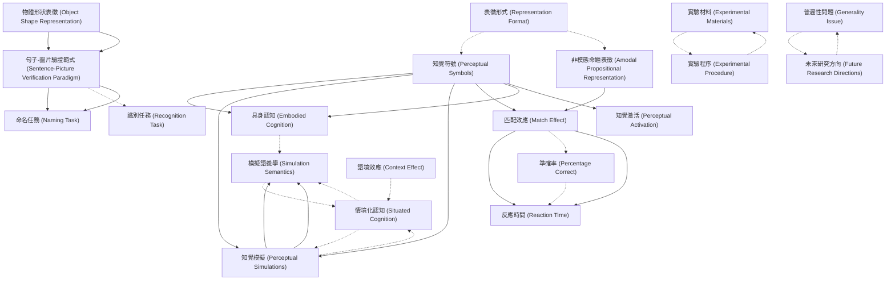

# Zettelkasten 卡片索引

**來源論文**: Zwaan-2002_Mental_Simulation
**作者**: 
**年份**: 2025
**生成日期**: 2025-10-29 16:50
**卡片總數**: 20

---

## 📚 卡片清單

### 1. [知覺符號 (Perceptual Symbols)](zettel_cards/CogSci-20251029-001.md)
- **ID**: `CogSci-20251029-001`
- **類型**: 
- **核心**: "Perceptual symbols are the residues of a perceptual experience, stored as patterns of activation in the brain."
- **標籤**: `知覺`, `符號`, `表徵`, `認知`

### 2. [知覺模擬 (Perceptual Simulations)](zettel_cards/CogSci-20251029-002.md)
- **ID**: `CogSci-20251029-002`
- **類型**: 
- **核心**: "Barsalou hypothesized that perceptual symbols are used in perceptual simulations that make up human cognitive processes."
- **標籤**: `知覺`, `模擬`, `認知`, `表徵`

### 3. [非模態命題表徵 (Amodal Propositional Representation)](zettel_cards/CogSci-20251029-003.md)
- **ID**: `CogSci-20251029-003`
- **類型**: 
- **核心**: "According to most theories of language comprehension, the linguistic input would be converted to a propositional representation (e.g., Kintsch, 1998; Kintsch & van Dijk, 1978)"
- **標籤**: `語言`, `理解`, `表徵`, `命題`

### 4. [匹配效應 (Match Effect)](zettel_cards/CogSci-20251029-004.md)
- **ID**: `CogSci-20251029-004`
- **類型**: 
- **核心**: "Responses were significantly faster when there was a match between implied orientation and pictured orientation than when there was a mismatch."
- **標籤**: `匹配`, `不匹配`, `反應時間`, `知覺`

### 5. [物體形狀表徵 (Object Shape Representation)](zettel_cards/CogSci-20251029-005.md)
- **ID**: `CogSci-20251029-005`
- **類型**: 
- **核心**: "if language comprehenders represent the implied orientation of objects, they should also represent their implied shape."
- **標籤**: `形狀`, `表徵`, `語言`, `理解`

### 6. [句子-圖片驗證範式 (Sentence-Picture Verification Paradigm)](zettel_cards/CogSci-20251029-006.md)
- **ID**: `CogSci-20251029-006`
- **類型**: 
- **核心**: "Subjects made speeded recognition responses as to whether the object in the picture was mentioned in the sentence."
- **標籤**: `範式`, `驗證`, `反應時間`, `實驗`

### 7. [命名任務 (Naming Task)](zettel_cards/CogSci-20251029-007.md)
- **ID**: `CogSci-20251029-007`
- **類型**: 
- **核心**: "The naming task arguably provides a stronger test of the perceptual hypothesis in that unlike a recognition task it does not require an explicit comparison between the sentence and the picture."
- **標籤**: `命名`, `任務`, `知覺`, `驗證`

### 8. [具身認知 (Embodied Cognition)](zettel_cards/CogSci-20251029-008.md)
- **ID**: `CogSci-20251029-008`
- **類型**: 
- **核心**: [原文沒有直接定義，需要根據上下文理解]
- **標籤**: `具身`, `認知`, `知覺`, `行動`

### 9. [模擬語義學 (Simulation Semantics)](zettel_cards/CogSci-20251029-009.md)
- **ID**: `CogSci-20251029-009`
- **類型**: 
- **核心**: [原文沒有直接定義，需要根據上下文理解]
- **標籤**: `語義`, `模擬`, `知覺`, `語言`

### 10. [情境化認知 (Situated Cognition)](zettel_cards/CogSci-20251029-010.md)
- **ID**: `CogSci-20251029-010`
- **類型**: 
- **核心**: [原文沒有直接定義，需要根據上下文理解]
- **標籤**: `情境`, `認知`, `知覺`, `環境`

### 11. [實驗材料 (Experimental Materials)](zettel_cards/CogSci-20251029-011.md)
- **ID**: `CogSci-20251029-011`
- **類型**: 
- **核心**: "Seventy-two black-and-white drawings obtained from Snodgrass and Vanderwart (1980) and from a popular clip-art package were used."
- **標籤**: `材料`, `圖畫`, `黑白`, `Snodgrass and Vanderwart`

### 12. [反應時間 (Reaction Time)](zettel_cards/CogSci-20251029-012.md)
- **ID**: `CogSci-20251029-012`
- **類型**: 
- **核心**: "Responses were significantly faster when sentence and picture matched than when they mismatched, F(1, 38) (cid:3) 13.14, p(cid:4) .001; F(1, 44) (cid:3) 14.54, p(cid:4) .0001."
- **標籤**: `反應時間`, `統計`, `匹配`, `不匹配`

### 13. [準確率 (Percentage Correct)](zettel_cards/CogSci-20251029-013.md)
- **ID**: `CogSci-20251029-013`
- **類型**: 
- **核心**: "Percentage correct 97 (6) 93 (7) —"
- **標籤**: `準確率`, `匹配`, `不匹配`, `實驗`

### 14. [實驗程序 (Experimental Procedure)](zettel_cards/CogSci-20251029-014.md)
- **ID**: `CogSci-20251029-014`
- **類型**: 
- **核心**: [需要根據論文其他部分推導]
- **標籤**: `程序`, `實驗`, `流程`, `認知`

### 15. [識別任務 (Recognition Task)](zettel_cards/CogSci-20251029-015.md)
- **ID**: `CogSci-20251029-015`
- **類型**: 
- **核心**: [需要根據論文其他部分推導]
- **標籤**: `識別`, `任務`, `圖片`, `句子`

### 16. [語境效應 (Context Effect)](zettel_cards/CogSci-20251029-016.md)
- **ID**: `CogSci-20251029-016`
- **類型**: 
- **核心**: [論文暗示但未直接點明]
- **標籤**: `語境`, `環境`, `理解`, `認知`

### 17. [表徵形式 (Representation Format)](zettel_cards/CogSci-20251029-017.md)
- **ID**: `CogSci-20251029-017`
- **類型**: 
- **核心**: [需要根據論文的核心論點推導]
- **標籤**: `表徵`, `形式`, `知覺`, `命題`

### 18. [知覺激活 (Perceptual Activation)](zettel_cards/CogSci-20251029-018.md)
- **ID**: `CogSci-20251029-018`
- **類型**: 
- **核心**: [需要根據實驗假設推導]
- **標籤**: `知覺`, `激活`, `語言`, `理解`

### 19. [普遍性問題 (Generality Issue)](zettel_cards/CogSci-20251029-019.md)
- **ID**: `CogSci-20251029-019`
- **類型**: 
- **核心**: [需要根據論文的討論部分推導]
- **標籤**: `普遍性`, `局限性`, `認知`, `語言`

### 20. [未來研究方向 (Future Research Directions)](zettel_cards/CogSci-20251029-020.md)
- **ID**: `CogSci-20251029-020`
- **類型**: 
- **核心**: [需要根據論文的結論部分推導]
- **標籤**: `研究`, `方向`, `未來`, `認知`

---

## 🗺️ 概念網絡圖

---

## 🏷️ 標籤索引

### 知覺
- [[CogSci-20251029-001]] 知覺符號 (Perceptual Symbols)
- [[CogSci-20251029-002]] 知覺模擬 (Perceptual Simulations)
- [[CogSci-20251029-004]] 匹配效應 (Match Effect)
- [[CogSci-20251029-007]] 命名任務 (Naming Task)
- [[CogSci-20251029-008]] 具身認知 (Embodied Cognition)
- [[CogSci-20251029-009]] 模擬語義學 (Simulation Semantics)
- [[CogSci-20251029-010]] 情境化認知 (Situated Cognition)
- [[CogSci-20251029-017]] 表徵形式 (Representation Format)
- [[CogSci-20251029-018]] 知覺激活 (Perceptual Activation)

### 符號
- [[CogSci-20251029-001]] 知覺符號 (Perceptual Symbols)

### 表徵
- [[CogSci-20251029-001]] 知覺符號 (Perceptual Symbols)
- [[CogSci-20251029-002]] 知覺模擬 (Perceptual Simulations)
- [[CogSci-20251029-003]] 非模態命題表徵 (Amodal Propositional Representation)
- [[CogSci-20251029-005]] 物體形狀表徵 (Object Shape Representation)
- [[CogSci-20251029-017]] 表徵形式 (Representation Format)

### 認知
- [[CogSci-20251029-001]] 知覺符號 (Perceptual Symbols)
- [[CogSci-20251029-002]] 知覺模擬 (Perceptual Simulations)
- [[CogSci-20251029-008]] 具身認知 (Embodied Cognition)
- [[CogSci-20251029-010]] 情境化認知 (Situated Cognition)
- [[CogSci-20251029-014]] 實驗程序 (Experimental Procedure)
- [[CogSci-20251029-016]] 語境效應 (Context Effect)
- [[CogSci-20251029-019]] 普遍性問題 (Generality Issue)
- [[CogSci-20251029-020]] 未來研究方向 (Future Research Directions)

### 模擬
- [[CogSci-20251029-002]] 知覺模擬 (Perceptual Simulations)
- [[CogSci-20251029-009]] 模擬語義學 (Simulation Semantics)

### 語言
- [[CogSci-20251029-003]] 非模態命題表徵 (Amodal Propositional Representation)
- [[CogSci-20251029-005]] 物體形狀表徵 (Object Shape Representation)
- [[CogSci-20251029-009]] 模擬語義學 (Simulation Semantics)
- [[CogSci-20251029-018]] 知覺激活 (Perceptual Activation)
- [[CogSci-20251029-019]] 普遍性問題 (Generality Issue)

### 理解
- [[CogSci-20251029-003]] 非模態命題表徵 (Amodal Propositional Representation)
- [[CogSci-20251029-005]] 物體形狀表徵 (Object Shape Representation)
- [[CogSci-20251029-016]] 語境效應 (Context Effect)
- [[CogSci-20251029-018]] 知覺激活 (Perceptual Activation)

### 命題
- [[CogSci-20251029-003]] 非模態命題表徵 (Amodal Propositional Representation)
- [[CogSci-20251029-017]] 表徵形式 (Representation Format)

### 匹配
- [[CogSci-20251029-004]] 匹配效應 (Match Effect)
- [[CogSci-20251029-012]] 反應時間 (Reaction Time)
- [[CogSci-20251029-013]] 準確率 (Percentage Correct)

### 不匹配
- [[CogSci-20251029-004]] 匹配效應 (Match Effect)
- [[CogSci-20251029-012]] 反應時間 (Reaction Time)
- [[CogSci-20251029-013]] 準確率 (Percentage Correct)

### 反應時間
- [[CogSci-20251029-004]] 匹配效應 (Match Effect)
- [[CogSci-20251029-006]] 句子-圖片驗證範式 (Sentence-Picture Verification Paradigm)
- [[CogSci-20251029-012]] 反應時間 (Reaction Time)

### 形狀
- [[CogSci-20251029-005]] 物體形狀表徵 (Object Shape Representation)

### 範式
- [[CogSci-20251029-006]] 句子-圖片驗證範式 (Sentence-Picture Verification Paradigm)

### 驗證
- [[CogSci-20251029-006]] 句子-圖片驗證範式 (Sentence-Picture Verification Paradigm)
- [[CogSci-20251029-007]] 命名任務 (Naming Task)

### 實驗
- [[CogSci-20251029-006]] 句子-圖片驗證範式 (Sentence-Picture Verification Paradigm)
- [[CogSci-20251029-013]] 準確率 (Percentage Correct)
- [[CogSci-20251029-014]] 實驗程序 (Experimental Procedure)

### 命名
- [[CogSci-20251029-007]] 命名任務 (Naming Task)

### 任務
- [[CogSci-20251029-007]] 命名任務 (Naming Task)
- [[CogSci-20251029-015]] 識別任務 (Recognition Task)

### 具身
- [[CogSci-20251029-008]] 具身認知 (Embodied Cognition)

### 行動
- [[CogSci-20251029-008]] 具身認知 (Embodied Cognition)

### 語義
- [[CogSci-20251029-009]] 模擬語義學 (Simulation Semantics)

### 情境
- [[CogSci-20251029-010]] 情境化認知 (Situated Cognition)

### 環境
- [[CogSci-20251029-010]] 情境化認知 (Situated Cognition)
- [[CogSci-20251029-016]] 語境效應 (Context Effect)

### 材料
- [[CogSci-20251029-011]] 實驗材料 (Experimental Materials)

### 圖畫
- [[CogSci-20251029-011]] 實驗材料 (Experimental Materials)

### 黑白
- [[CogSci-20251029-011]] 實驗材料 (Experimental Materials)

### Snodgrass and Vanderwart
- [[CogSci-20251029-011]] 實驗材料 (Experimental Materials)

### 統計
- [[CogSci-20251029-012]] 反應時間 (Reaction Time)

### 準確率
- [[CogSci-20251029-013]] 準確率 (Percentage Correct)

### 程序
- [[CogSci-20251029-014]] 實驗程序 (Experimental Procedure)

### 流程
- [[CogSci-20251029-014]] 實驗程序 (Experimental Procedure)

### 識別
- [[CogSci-20251029-015]] 識別任務 (Recognition Task)

### 圖片
- [[CogSci-20251029-015]] 識別任務 (Recognition Task)

### 句子
- [[CogSci-20251029-015]] 識別任務 (Recognition Task)

### 語境
- [[CogSci-20251029-016]] 語境效應 (Context Effect)

### 形式
- [[CogSci-20251029-017]] 表徵形式 (Representation Format)

### 激活
- [[CogSci-20251029-018]] 知覺激活 (Perceptual Activation)

### 普遍性
- [[CogSci-20251029-019]] 普遍性問題 (Generality Issue)

### 局限性
- [[CogSci-20251029-019]] 普遍性問題 (Generality Issue)

### 研究
- [[CogSci-20251029-020]] 未來研究方向 (Future Research Directions)

### 方向
- [[CogSci-20251029-020]] 未來研究方向 (Future Research Directions)

### 未來
- [[CogSci-20251029-020]] 未來研究方向 (Future Research Directions)

---

## 📖 閱讀建議順序

1. [[CogSci-20251029-003]] 非模態命題表徵 (Amodal Propositional Representation)

2. [[CogSci-20251029-007]] 命名任務 (Naming Task)

3. [[CogSci-20251029-008]] 具身認知 (Embodied Cognition)

4. [[CogSci-20251029-009]] 模擬語義學 (Simulation Semantics)

5. [[CogSci-20251029-010]] 情境化認知 (Situated Cognition)

6. [[CogSci-20251029-011]] 實驗材料 (Experimental Materials)

7. [[CogSci-20251029-012]] 反應時間 (Reaction Time)

8. [[CogSci-20251029-013]] 準確率 (Percentage Correct)

9. [[CogSci-20251029-014]] 實驗程序 (Experimental Procedure)

10. [[CogSci-20251029-015]] 識別任務 (Recognition Task)

11. [[CogSci-20251029-016]] 語境效應 (Context Effect)

12. [[CogSci-20251029-017]] 表徵形式 (Representation Format)

13. [[CogSci-20251029-018]] 知覺激活 (Perceptual Activation)

14. [[CogSci-20251029-019]] 普遍性問題 (Generality Issue)

15. [[CogSci-20251029-020]] 未來研究方向 (Future Research Directions)

16. [[CogSci-20251029-002]] 知覺模擬 (Perceptual Simulations)

17. [[CogSci-20251029-004]] 匹配效應 (Match Effect)

18. [[CogSci-20251029-005]] 物體形狀表徵 (Object Shape Representation)

19. [[CogSci-20251029-006]] 句子-圖片驗證範式 (Sentence-Picture Verification Paradigm)

20. [[CogSci-20251029-001]] 知覺符號 (Perceptual Symbols)

---

*本索引由 Knowledge Production System 自動生成*