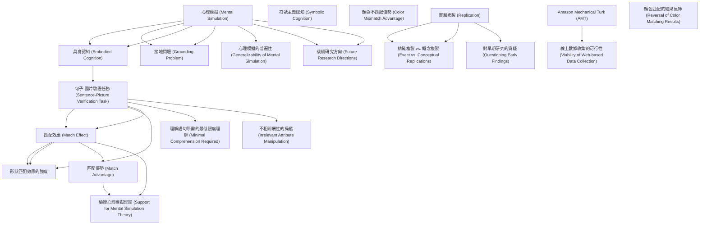

# Zettelkasten 卡片索引

**來源論文**: Zwaan-2012_Mental_Simulation
**作者**: 
**年份**: 2025
**生成日期**: 2025-10-29 16:51
**卡片總數**: 21

---

## 📚 卡片清單

### 1. [心理模擬 (Mental Simulation)](zettel_cards/CogSci-20251029-001.md)
- **ID**: `CogSci-20251029-001`
- **類型**: 
- **核心**: "cognition should be viewed as the mental simulation of events by reactivating traces of earlier experiences."
- **標籤**: `心理模擬`, `認知`, `語言理解`

### 2. [具身認知 (Embodied Cognition)](zettel_cards/CogSci-20251029-002.md)
- **ID**: `CogSci-20251029-002`
- **類型**: 
- **核心**: "language comprehension should not be viewed as the disembodied manipulation of symbols, the way a computer might do it."
- **標籤**: `具身認知`, `語言理解`, `認知科學`

### 3. [接地問題 (Grounding Problem)](zettel_cards/CogSci-20251029-003.md)
- **ID**: `CogSci-20251029-003`
- **類型**: 
- **核心**: "Abstract, amodal, and arbitrary symbols have no connection to actual experience; they are floating free in some mental ether and are therefore essentially meaningless."
- **標籤**: `接地問題`, `符號主義`, `認知科學`

### 4. [符號主義認知 (Symbolic Cognition)](zettel_cards/CogSci-20251029-004.md)
- **ID**: `CogSci-20251029-004`
- **類型**: 
- **核心**: "The working assumption up to about 15 years ago had been that the human mind manipulates abstract, arbitrary, and amodal symbols..."
- **標籤**: `符號主義`, `認知科學`, `人工智慧`

### 5. [句子-圖片驗證任務 (Sentence-Picture Verification Task)](zettel_cards/CogSci-20251029-005.md)
- **ID**: `CogSci-20251029-005`
- **類型**: 
- **核心**: "Participants read a sentence in which the orientation of an object is implied, rather than stated explicitly, and then they decide whether the object shown in the subsequently presented picture was mentioned in the sentence."
- **標籤**: `句子-圖片驗證`, `實驗方法`, `心理學`

### 6. [匹配效應 (Match Effect)](zettel_cards/CogSci-20251029-006.md)
- **ID**: `CogSci-20251029-006`
- **類型**: 
- **核心**: "Participants were faster to verify pictures that matched the implied orientation than pictures that mismatched [4]."
- **標籤**: `匹配效應`, `句子-圖片驗證`, `方向`

### 7. [形狀匹配效應的強度](zettel_cards/CogSci-20251029-007.md)
- **ID**: `CogSci-20251029-007`
- **類型**: 
- **核心**: "As in the orientation study, a significant match effect was obtained, which appeared more robust than the orientation effect, as indicated by the effect sizes inTable1."
- **標籤**: `形狀`, `匹配效應`, `句子-圖片驗證`

### 8. [顏色不匹配優勢 (Color Mismatch Advantage)](zettel_cards/CogSci-20251029-008.md)
- **ID**: `CogSci-20251029-008`
- **類型**: 
- **核心**: "Surprisingly, in light of the earlier findings, Connell obtained significantly faster responses to the mismatching than to the matching items, which she nevertheless interpreted as support for mental simulation theory."
- **標籤**: `顏色`, `句子-圖片驗證`, `不匹配優勢`

### 9. [實驗複製 (Replication)](zettel_cards/CogSci-20251029-009.md)
- **ID**: `CogSci-20251029-009`
- **類型**: 
- **核心**: "Our goal in this article is to take a step back and revisit these experiments by performing exact replications."
- **標籤**: `實驗複製`, `科學方法`, `可重複性`

### 10. [精確複製 vs. 概念複製 (Exact vs. Conceptual Replications)](zettel_cards/CogSci-20251029-010.md)
- **ID**: `CogSci-20251029-010`
- **類型**: 
- **核心**: "One can think of exact and conceptual replications as being on a continuum, where by one endpoint (‘‘exact’’) can only be approximated."
- **標籤**: `精確複製`, `概念複製`, `科學方法`

### 11. [Amazon Mechanical Turk (AMT)](zettel_cards/CogSci-20251029-011.md)
- **ID**: `CogSci-20251029-011`
- **類型**: 
- **核心**: "For each of these sets of findings, we conducted two web-based replication attempts using Amazon’s Mechanical Turk."
- **標籤**: `AMT`, `網路實驗`, `心理學研究`

### 12. [心理模擬的普遍性 (Generalizability of Mental Simulation)](zettel_cards/CogSci-20251029-012.md)
- **ID**: `CogSci-20251029-012`
- **類型**: 
- **核心**: "If it is found that comprehenders mentally simulate the orientation of objects, then wouldn’t they also simulate shape, color, motion, and perspective (to name just a few topics)?"
- **標籤**: `普遍性`, `心理模擬`, `語言理解`

### 13. [對早期研究的質疑 (Questioning Early Findings)](zettel_cards/CogSci-20251029-013.md)
- **ID**: `CogSci-20251029-013`
- **類型**: 
- **核心**: "However, the downside of such a novelty-seeking approach is that the original findings, which may have spawned a large number of follow-up studies, are never exactly replicated."
- **標籤**: `質疑`, `早期研究`, `科學方法`

### 14. [匹配優勢 (Match Advantage)](zettel_cards/CogSci-20251029-014.md)
- **ID**: `CogSci-20251029-014`
- **類型**: 
- **核心**: "Participants responded faster to pictures that matched the orientation or shape implied by the sentence, replicating the original findings."
- **標籤**: `匹配優勢`, `句子-圖片驗證`, `心理模擬`

### 15. [顏色匹配的結果反轉 (Reversal of Color Matching Results)](zettel_cards/CogSci-20251029-015.md)
- **ID**: `CogSci-20251029-015`
- **類型**: 
- **核心**: "Participants also responded faster to pictures that matched the color implied by the sentence, whereas the original studies obtained mismatch advantages."
- **標籤**: `顏色匹配`, `結果反轉`, `心理模擬`

### 16. [線上數據收集的可行性 (Viability of Web-based Data Collection)](zettel_cards/CogSci-20251029-016.md)
- **ID**: `CogSci-20251029-016`
- **類型**: 
- **核心**: "Wearguethattheseresultssupportmentalsimulationtheory,showtheimportanceofreplicationstudies,and show the viabilityofweb-based data collection."
- **標籤**: `線上數據收集`, `心理學研究`, `AMT`

### 17. [理解語句所需的最低限度理解 (Minimal Comprehension Required)](zettel_cards/CogSci-20251029-017.md)
- **ID**: `CogSci-20251029-017`
- **類型**: 
- **核心**: "To ensure that participants engage in some minimal form of comprehension, they are prompted at irregular intervals to recall a previously seen sentence or answer a question about it."
- **標籤**: `最低限度理解`, `句子-圖片驗證`, `實驗設計`

### 18. [不相關屬性的操縱 (Irrelevant Attribute Manipulation)](zettel_cards/CogSci-20251029-018.md)
- **ID**: `CogSci-20251029-018`
- **類型**: 
- **核心**: "Crucial to the task is that the pictured object’s orientation is irrelevant. The participants merely indicate if the object was mentioned in the sentence or not, a very simple task given that it is blatantly obvious when the pictured object is not mentioned in the sentence."
- **標籤**: `不相關屬性`, `實驗操縱`, `句子-圖片驗證`

### 19. [驗證心理模擬理論 (Support for Mental Simulation Theory)](zettel_cards/CogSci-20251029-019.md)
- **ID**: `CogSci-20251029-019`
- **類型**: 
- **核心**: "Wearguethattheseresultssupportmentalsimulationtheory..."
- **標籤**: `驗證`, `心理模擬`, `結論`

### 20. [後續研究方向 (Future Research Directions)](zettel_cards/CogSci-20251029-020.md)
- **ID**: `CogSci-20251029-020`
- **類型**: 
- **核心**: (基於整篇文章的總結性問題)
- **標籤**: `後續研究`, `心理模擬`, `語言理解`

### 21. [後續研究方向 (Future Research Directions)](zettel_cards/CogSci-20251029-020.md)
- **ID**: `CogSci-20251029-020`
- **類型**: 
- **核心**: (基於整篇文章的總結性問題)
- **標籤**: `後續研究`, `心理模擬`, `語言理解`

---

## 🗺️ 概念網絡圖

---

## 🏷️ 標籤索引

### 心理模擬
- [[CogSci-20251029-001]] 心理模擬 (Mental Simulation)
- [[CogSci-20251029-012]] 心理模擬的普遍性 (Generalizability of Mental Simulation)
- [[CogSci-20251029-014]] 匹配優勢 (Match Advantage)
- [[CogSci-20251029-015]] 顏色匹配的結果反轉 (Reversal of Color Matching Results)
- [[CogSci-20251029-019]] 驗證心理模擬理論 (Support for Mental Simulation Theory)
- [[CogSci-20251029-020]] 後續研究方向 (Future Research Directions)
- [[CogSci-20251029-020]] 後續研究方向 (Future Research Directions)

### 認知
- [[CogSci-20251029-001]] 心理模擬 (Mental Simulation)

### 語言理解
- [[CogSci-20251029-001]] 心理模擬 (Mental Simulation)
- [[CogSci-20251029-002]] 具身認知 (Embodied Cognition)
- [[CogSci-20251029-012]] 心理模擬的普遍性 (Generalizability of Mental Simulation)
- [[CogSci-20251029-020]] 後續研究方向 (Future Research Directions)
- [[CogSci-20251029-020]] 後續研究方向 (Future Research Directions)

### 具身認知
- [[CogSci-20251029-002]] 具身認知 (Embodied Cognition)

### 認知科學
- [[CogSci-20251029-002]] 具身認知 (Embodied Cognition)
- [[CogSci-20251029-003]] 接地問題 (Grounding Problem)
- [[CogSci-20251029-004]] 符號主義認知 (Symbolic Cognition)

### 接地問題
- [[CogSci-20251029-003]] 接地問題 (Grounding Problem)

### 符號主義
- [[CogSci-20251029-003]] 接地問題 (Grounding Problem)
- [[CogSci-20251029-004]] 符號主義認知 (Symbolic Cognition)

### 人工智慧
- [[CogSci-20251029-004]] 符號主義認知 (Symbolic Cognition)

### 句子-圖片驗證
- [[CogSci-20251029-005]] 句子-圖片驗證任務 (Sentence-Picture Verification Task)
- [[CogSci-20251029-006]] 匹配效應 (Match Effect)
- [[CogSci-20251029-007]] 形狀匹配效應的強度
- [[CogSci-20251029-008]] 顏色不匹配優勢 (Color Mismatch Advantage)
- [[CogSci-20251029-014]] 匹配優勢 (Match Advantage)
- [[CogSci-20251029-017]] 理解語句所需的最低限度理解 (Minimal Comprehension Required)
- [[CogSci-20251029-018]] 不相關屬性的操縱 (Irrelevant Attribute Manipulation)

### 實驗方法
- [[CogSci-20251029-005]] 句子-圖片驗證任務 (Sentence-Picture Verification Task)

### 心理學
- [[CogSci-20251029-005]] 句子-圖片驗證任務 (Sentence-Picture Verification Task)

### 匹配效應
- [[CogSci-20251029-006]] 匹配效應 (Match Effect)
- [[CogSci-20251029-007]] 形狀匹配效應的強度

### 方向
- [[CogSci-20251029-006]] 匹配效應 (Match Effect)

### 形狀
- [[CogSci-20251029-007]] 形狀匹配效應的強度

### 顏色
- [[CogSci-20251029-008]] 顏色不匹配優勢 (Color Mismatch Advantage)

### 不匹配優勢
- [[CogSci-20251029-008]] 顏色不匹配優勢 (Color Mismatch Advantage)

### 實驗複製
- [[CogSci-20251029-009]] 實驗複製 (Replication)

### 科學方法
- [[CogSci-20251029-009]] 實驗複製 (Replication)
- [[CogSci-20251029-010]] 精確複製 vs. 概念複製 (Exact vs. Conceptual Replications)
- [[CogSci-20251029-013]] 對早期研究的質疑 (Questioning Early Findings)

### 可重複性
- [[CogSci-20251029-009]] 實驗複製 (Replication)

### 精確複製
- [[CogSci-20251029-010]] 精確複製 vs. 概念複製 (Exact vs. Conceptual Replications)

### 概念複製
- [[CogSci-20251029-010]] 精確複製 vs. 概念複製 (Exact vs. Conceptual Replications)

### AMT
- [[CogSci-20251029-011]] Amazon Mechanical Turk (AMT)
- [[CogSci-20251029-016]] 線上數據收集的可行性 (Viability of Web-based Data Collection)

### 網路實驗
- [[CogSci-20251029-011]] Amazon Mechanical Turk (AMT)

### 心理學研究
- [[CogSci-20251029-011]] Amazon Mechanical Turk (AMT)
- [[CogSci-20251029-016]] 線上數據收集的可行性 (Viability of Web-based Data Collection)

### 普遍性
- [[CogSci-20251029-012]] 心理模擬的普遍性 (Generalizability of Mental Simulation)

### 質疑
- [[CogSci-20251029-013]] 對早期研究的質疑 (Questioning Early Findings)

### 早期研究
- [[CogSci-20251029-013]] 對早期研究的質疑 (Questioning Early Findings)

### 匹配優勢
- [[CogSci-20251029-014]] 匹配優勢 (Match Advantage)

### 顏色匹配
- [[CogSci-20251029-015]] 顏色匹配的結果反轉 (Reversal of Color Matching Results)

### 結果反轉
- [[CogSci-20251029-015]] 顏色匹配的結果反轉 (Reversal of Color Matching Results)

### 線上數據收集
- [[CogSci-20251029-016]] 線上數據收集的可行性 (Viability of Web-based Data Collection)

### 最低限度理解
- [[CogSci-20251029-017]] 理解語句所需的最低限度理解 (Minimal Comprehension Required)

### 實驗設計
- [[CogSci-20251029-017]] 理解語句所需的最低限度理解 (Minimal Comprehension Required)

### 不相關屬性
- [[CogSci-20251029-018]] 不相關屬性的操縱 (Irrelevant Attribute Manipulation)

### 實驗操縱
- [[CogSci-20251029-018]] 不相關屬性的操縱 (Irrelevant Attribute Manipulation)

### 驗證
- [[CogSci-20251029-019]] 驗證心理模擬理論 (Support for Mental Simulation Theory)

### 結論
- [[CogSci-20251029-019]] 驗證心理模擬理論 (Support for Mental Simulation Theory)

### 後續研究
- [[CogSci-20251029-020]] 後續研究方向 (Future Research Directions)
- [[CogSci-20251029-020]] 後續研究方向 (Future Research Directions)

---

## 📖 閱讀建議順序

1. [[CogSci-20251029-002]] 具身認知 (Embodied Cognition)

2. [[CogSci-20251029-003]] 接地問題 (Grounding Problem)

3. [[CogSci-20251029-004]] 符號主義認知 (Symbolic Cognition)

4. [[CogSci-20251029-007]] 形狀匹配效應的強度

5. [[CogSci-20251029-008]] 顏色不匹配優勢 (Color Mismatch Advantage)

6. [[CogSci-20251029-010]] 精確複製 vs. 概念複製 (Exact vs. Conceptual Replications)

7. [[CogSci-20251029-012]] 心理模擬的普遍性 (Generalizability of Mental Simulation)

8. [[CogSci-20251029-013]] 對早期研究的質疑 (Questioning Early Findings)

9. [[CogSci-20251029-015]] 顏色匹配的結果反轉 (Reversal of Color Matching Results)

10. [[CogSci-20251029-016]] 線上數據收集的可行性 (Viability of Web-based Data Collection)

11. [[CogSci-20251029-017]] 理解語句所需的最低限度理解 (Minimal Comprehension Required)

12. [[CogSci-20251029-018]] 不相關屬性的操縱 (Irrelevant Attribute Manipulation)

13. [[CogSci-20251029-019]] 驗證心理模擬理論 (Support for Mental Simulation Theory)

14. [[CogSci-20251029-020]] 後續研究方向 (Future Research Directions)

15. [[CogSci-20251029-020]] 後續研究方向 (Future Research Directions)

16. [[CogSci-20251029-011]] Amazon Mechanical Turk (AMT)

17. [[CogSci-20251029-014]] 匹配優勢 (Match Advantage)

18. [[CogSci-20251029-009]] 實驗複製 (Replication)

19. [[CogSci-20251029-005]] 句子-圖片驗證任務 (Sentence-Picture Verification Task)

20. [[CogSci-20251029-006]] 匹配效應 (Match Effect)

21. [[CogSci-20251029-001]] 心理模擬 (Mental Simulation)

---

*本索引由 Knowledge Production System 自動生成*