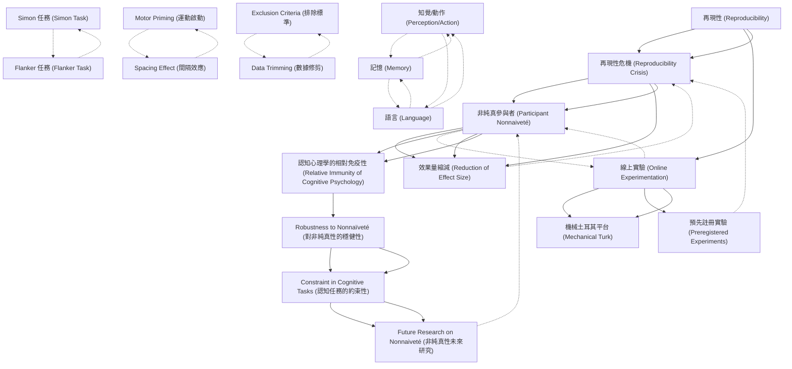

# Zettelkasten 卡片索引

**來源論文**: Zwaan-2018_Mental_Simulation
**作者**: 
**年份**: 2025
**生成日期**: 2025-10-29 16:51
**卡片總數**: 20

---

## 📚 卡片清單

### 1. [再現性 (Reproducibility)](zettel_cards/CogSci-20251029-001.md)
- **ID**: `CogSci-20251029-001`
- **類型**: 
- **核心**: "A hallmark of science is reproducibility."
- **標籤**: `科學方法`, `再現性`, `心理學`

### 2. [再現性危機 (Reproducibility Crisis)](zettel_cards/CogSci-20251029-002.md)
- **ID**: `CogSci-20251029-002`
- **類型**: 
- **核心**: "There is growing awareness that problems exist with reproducibility in psychology."
- **標籤**: `再現性`, `心理學`, `科學爭議`

### 3. [線上實驗 (Online Experimentation)](zettel_cards/CogSci-20251029-003.md)
- **ID**: `CogSci-20251029-003`
- **類型**: 
- **核心**: "Crowd-sourcing websites, such as Amazon Mechanical Turk, offered the prospect of more efficient, powerful, and generalizable ways of testing psychological theories."
- **標籤**: `線上研究`, `研究方法`, `Mechanical Turk`

### 4. [非純真參與者 (Participant Nonnaiveté)](zettel_cards/CogSci-20251029-004.md)
- **ID**: `CogSci-20251029-004`
- **類型**: 
- **核心**: "Of particular concern for reproducibility, participants may participate in studies in which they have participated before."
- **標籤**: `參與者`, `研究偏差`, `純真性`

### 5. [效果量縮減 (Reduction of Effect Size)](zettel_cards/CogSci-20251029-005.md)
- **ID**: `CogSci-20251029-005`
- **類型**: 
- **核心**: "A recent preregistered study found sizable reductions in decision-making effects among participants had previously participated in the same studies, suggesting that nonnaïve participants may pose a threat to reproducibility"
- **標籤**: `效果量`, `再現性`, `研究結果`

### 6. [機械土耳其平台 (Mechanical Turk)](zettel_cards/CogSci-20251029-006.md)
- **ID**: `CogSci-20251029-006`
- **類型**: 
- **核心**: "We tested the hypothesis that cognitive psychology is relatively immune to nonnaïveté effects in a series of nine preregistered experiments."
- **標籤**: `線上平台`, `研究方法`, `實驗設計`

### 7. [預先註冊實驗 (Preregistered Experiments)](zettel_cards/CogSci-20251029-007.md)
- **ID**: `CogSci-20251029-007`
- **類型**: 
- **核心**: "Wetestedthehypothesisthatcognitivepsychologyisrel- atively immune to nonnaïveté effects in a series of nine preregistered experiments"
- **標籤**: `研究方法`, `科學嚴謹性`, `實驗設計`

### 8. [認知心理學的相對免疫性 (Relative Immunity of Cognitive Psychology)](zettel_cards/CogSci-20251029-008.md)
- **ID**: `CogSci-20251029-008`
- **類型**: 
- **核心**: "We tested the hypothesis that cognitive psychology is relatively immune to nonnaïveté effects..."
- **標籤**: `認知心理學`, `非純真效應`, `研究假設`

### 9. [知覺/動作 (Perception/Action)](zettel_cards/CogSci-20251029-009.md)
- **ID**: `CogSci-20251029-009`
- **類型**: 
- **核心**: "Therefore, we selected three experiments each from the domains of perception/action, memory, and language, arguably the major areas in the field of cognitive psychology."
- **標籤**: `認知心理學`, `研究領域`, `知覺`

### 10. [記憶 (Memory)](zettel_cards/CogSci-20251029-010.md)
- **ID**: `CogSci-20251029-010`
- **類型**: 
- **核心**: "Therefore, we selected three experiments each from the domains of perception/action, memory, and language, arguably the major areas in the field of cognitive psychology."
- **標籤**: `認知心理學`, `研究領域`, `記憶`

### 11. [語言 (Language)](zettel_cards/CogSci-20251029-011.md)
- **ID**: `CogSci-20251029-011`
- **類型**: 
- **核心**: "Therefore, we selected three experiments each from the domains of perception/action, memory, and language, arguably the major areas in the field of cognitive psychology."
- **標籤**: `認知心理學`, `研究領域`, `語言`

### 12. [Simon 任務 (Simon Task)](zettel_cards/CogSci-20251029-012.md)
- **ID**: `CogSci-20251029-012`
- **類型**: 
- **核心**: "Choice-reaction time task that measures spatial compatibility."
- **標籤**: `實驗任務`, `反應時間`, `空間兼容性`

### 13. [Flanker 任務 (Flanker Task)](zettel_cards/CogSci-20251029-013.md)
- **ID**: `CogSci-20251029-013`
- **類型**: 
- **核心**: "Response inhibition task in which relevant information is selected and inappropriate responses in a certain context are suppressed."
- **標籤**: `實驗任務`, `反應抑制`, `注意力`

### 14. [Motor Priming (運動啟動)](zettel_cards/CogSci-20251029-014.md)
- **ID**: `CogSci-20251029-014`
- **類型**: 
- **核心**: "A task with a priming procedure in which responses to stimuli (arrow probes <<) are primed by presented compatible (<<) or incompatible (>>) items."
- **標籤**: `實驗任務`, `啟動效應`, `運動反應`

### 15. [Spacing Effect (間隔效應)](zettel_cards/CogSci-20251029-015.md)
- **ID**: `CogSci-20251029-015`
- **類型**: 
- **核心**: "Learning task in which learning (of words) is spaced over time."
- **標籤**: `實驗任務`, `學習`, `間隔重複`

### 16. [Exclusion Criteria (排除標準)](zettel_cards/CogSci-20251029-016.md)
- **ID**: `CogSci-20251029-016`
- **類型**: 
- **核心**: "Data from participants with an accuracy <80% in RT tasks or an accuracy <10% in memory tasks or a mean (reaction time) RT longer than the group M+3SD were excluded."
- **標籤**: `數據分析`, `排除標準`, `研究方法`

### 17. [Data Trimming (數據修剪)](zettel_cards/CogSci-20251029-017.md)
- **ID**: `CogSci-20251029-017`
- **類型**: 
- **核心**: "Data from each participant in the RT tasks were trimmed by excluding trials where the trial RT deviated more than 3SD from the subject M."
- **標籤**: `數據分析`, `數據修剪`, `研究方法`

### 18. [Robustness to Nonnaïveté (對非純真性的穩健性)](zettel_cards/CogSci-20251029-018.md)
- **ID**: `CogSci-20251029-018`
- **類型**: 
- **核心**: "Apparently, some cognitive tasks are so constraining that they encapsulate behavior from external influences, such as testing situation and prior recent experience with the experiment to yield highly robust effects."
- **標籤**: `研究結果`, `認知任務`, `非純真性`

### 19. [Constraint in Cognitive Tasks (認知任務的約束性)](zettel_cards/CogSci-20251029-019.md)
- **ID**: `CogSci-20251029-019`
- **類型**: 
- **核心**: "Apparently, some cognitive tasks are so constraining that they encapsulate behavior from external influences...to yield highly robust effects."
- **標籤**: `認知心理學`, `認知任務`, `約束性`

### 20. [Future Research on Nonnaiveté (非純真性未來研究)](zettel_cards/CogSci-20251029-020.md)
- **ID**: `CogSci-20251029-020`
- **類型**: 
- **核心**: "It is unknown whether these findings are robust to the presence of nonnaïve participants."
- **標籤**: `非純真性`, `未來研究`, `認知心理學`

---

## 🗺️ 概念網絡圖

---

## 🏷️ 標籤索引

### 科學方法
- [[CogSci-20251029-001]] 再現性 (Reproducibility)

### 再現性
- [[CogSci-20251029-001]] 再現性 (Reproducibility)
- [[CogSci-20251029-002]] 再現性危機 (Reproducibility Crisis)
- [[CogSci-20251029-005]] 效果量縮減 (Reduction of Effect Size)

### 心理學
- [[CogSci-20251029-001]] 再現性 (Reproducibility)
- [[CogSci-20251029-002]] 再現性危機 (Reproducibility Crisis)

### 科學爭議
- [[CogSci-20251029-002]] 再現性危機 (Reproducibility Crisis)

### 線上研究
- [[CogSci-20251029-003]] 線上實驗 (Online Experimentation)

### 研究方法
- [[CogSci-20251029-003]] 線上實驗 (Online Experimentation)
- [[CogSci-20251029-006]] 機械土耳其平台 (Mechanical Turk)
- [[CogSci-20251029-007]] 預先註冊實驗 (Preregistered Experiments)
- [[CogSci-20251029-016]] Exclusion Criteria (排除標準)
- [[CogSci-20251029-017]] Data Trimming (數據修剪)

### Mechanical Turk
- [[CogSci-20251029-003]] 線上實驗 (Online Experimentation)

### 參與者
- [[CogSci-20251029-004]] 非純真參與者 (Participant Nonnaiveté)

### 研究偏差
- [[CogSci-20251029-004]] 非純真參與者 (Participant Nonnaiveté)

### 純真性
- [[CogSci-20251029-004]] 非純真參與者 (Participant Nonnaiveté)

### 效果量
- [[CogSci-20251029-005]] 效果量縮減 (Reduction of Effect Size)

### 研究結果
- [[CogSci-20251029-005]] 效果量縮減 (Reduction of Effect Size)
- [[CogSci-20251029-018]] Robustness to Nonnaïveté (對非純真性的穩健性)

### 線上平台
- [[CogSci-20251029-006]] 機械土耳其平台 (Mechanical Turk)

### 實驗設計
- [[CogSci-20251029-006]] 機械土耳其平台 (Mechanical Turk)
- [[CogSci-20251029-007]] 預先註冊實驗 (Preregistered Experiments)

### 科學嚴謹性
- [[CogSci-20251029-007]] 預先註冊實驗 (Preregistered Experiments)

### 認知心理學
- [[CogSci-20251029-008]] 認知心理學的相對免疫性 (Relative Immunity of Cognitive Psychology)
- [[CogSci-20251029-009]] 知覺/動作 (Perception/Action)
- [[CogSci-20251029-010]] 記憶 (Memory)
- [[CogSci-20251029-011]] 語言 (Language)
- [[CogSci-20251029-019]] Constraint in Cognitive Tasks (認知任務的約束性)
- [[CogSci-20251029-020]] Future Research on Nonnaiveté (非純真性未來研究)

### 非純真效應
- [[CogSci-20251029-008]] 認知心理學的相對免疫性 (Relative Immunity of Cognitive Psychology)

### 研究假設
- [[CogSci-20251029-008]] 認知心理學的相對免疫性 (Relative Immunity of Cognitive Psychology)

### 研究領域
- [[CogSci-20251029-009]] 知覺/動作 (Perception/Action)
- [[CogSci-20251029-010]] 記憶 (Memory)
- [[CogSci-20251029-011]] 語言 (Language)

### 知覺
- [[CogSci-20251029-009]] 知覺/動作 (Perception/Action)

### 記憶
- [[CogSci-20251029-010]] 記憶 (Memory)

### 語言
- [[CogSci-20251029-011]] 語言 (Language)

### 實驗任務
- [[CogSci-20251029-012]] Simon 任務 (Simon Task)
- [[CogSci-20251029-013]] Flanker 任務 (Flanker Task)
- [[CogSci-20251029-014]] Motor Priming (運動啟動)
- [[CogSci-20251029-015]] Spacing Effect (間隔效應)

### 反應時間
- [[CogSci-20251029-012]] Simon 任務 (Simon Task)

### 空間兼容性
- [[CogSci-20251029-012]] Simon 任務 (Simon Task)

### 反應抑制
- [[CogSci-20251029-013]] Flanker 任務 (Flanker Task)

### 注意力
- [[CogSci-20251029-013]] Flanker 任務 (Flanker Task)

### 啟動效應
- [[CogSci-20251029-014]] Motor Priming (運動啟動)

### 運動反應
- [[CogSci-20251029-014]] Motor Priming (運動啟動)

### 學習
- [[CogSci-20251029-015]] Spacing Effect (間隔效應)

### 間隔重複
- [[CogSci-20251029-015]] Spacing Effect (間隔效應)

### 數據分析
- [[CogSci-20251029-016]] Exclusion Criteria (排除標準)
- [[CogSci-20251029-017]] Data Trimming (數據修剪)

### 排除標準
- [[CogSci-20251029-016]] Exclusion Criteria (排除標準)

### 數據修剪
- [[CogSci-20251029-017]] Data Trimming (數據修剪)

### 認知任務
- [[CogSci-20251029-018]] Robustness to Nonnaïveté (對非純真性的穩健性)
- [[CogSci-20251029-019]] Constraint in Cognitive Tasks (認知任務的約束性)

### 非純真性
- [[CogSci-20251029-018]] Robustness to Nonnaïveté (對非純真性的穩健性)
- [[CogSci-20251029-020]] Future Research on Nonnaiveté (非純真性未來研究)

### 約束性
- [[CogSci-20251029-019]] Constraint in Cognitive Tasks (認知任務的約束性)

### 未來研究
- [[CogSci-20251029-020]] Future Research on Nonnaiveté (非純真性未來研究)

---

## 📖 閱讀建議順序

1. [[CogSci-20251029-005]] 效果量縮減 (Reduction of Effect Size)

2. [[CogSci-20251029-006]] 機械土耳其平台 (Mechanical Turk)

3. [[CogSci-20251029-007]] 預先註冊實驗 (Preregistered Experiments)

4. [[CogSci-20251029-009]] 知覺/動作 (Perception/Action)

5. [[CogSci-20251029-010]] 記憶 (Memory)

6. [[CogSci-20251029-011]] 語言 (Language)

7. [[CogSci-20251029-012]] Simon 任務 (Simon Task)

8. [[CogSci-20251029-013]] Flanker 任務 (Flanker Task)

9. [[CogSci-20251029-014]] Motor Priming (運動啟動)

10. [[CogSci-20251029-015]] Spacing Effect (間隔效應)

11. [[CogSci-20251029-016]] Exclusion Criteria (排除標準)

12. [[CogSci-20251029-017]] Data Trimming (數據修剪)

13. [[CogSci-20251029-020]] Future Research on Nonnaiveté (非純真性未來研究)

14. [[CogSci-20251029-001]] 再現性 (Reproducibility)

15. [[CogSci-20251029-002]] 再現性危機 (Reproducibility Crisis)

16. [[CogSci-20251029-003]] 線上實驗 (Online Experimentation)

17. [[CogSci-20251029-008]] 認知心理學的相對免疫性 (Relative Immunity of Cognitive Psychology)

18. [[CogSci-20251029-018]] Robustness to Nonnaïveté (對非純真性的穩健性)

19. [[CogSci-20251029-019]] Constraint in Cognitive Tasks (認知任務的約束性)

20. [[CogSci-20251029-004]] 非純真參與者 (Participant Nonnaiveté)

---

*本索引由 Knowledge Production System 自動生成*