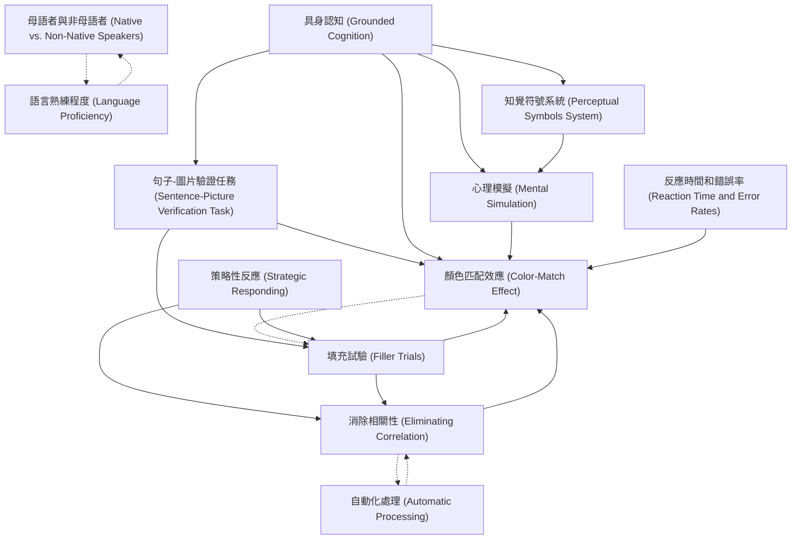

# Zettelkasten 卡片索引

---

## 📚 卡片清單

### 1. [具身認知 (Grounded Cognition)](zettel_cards/vanZuijlen-2024-001.md)
- **ID**: `vanZuijlen-2024-001`
- **類型**: 
- **核心**: "According to grounded cognition theories, the features that are activated during language comprehension are based on earlier perceptual-motor experiences with the objects described in the sentences."
- **標籤**: `具身認知`, `語言理解`, `感知運動經驗`

### 2. [句子-圖片驗證任務 (Sentence-Picture Verification Task)](zettel_cards/vanZuijlen-2024-002.md)
- **ID**: `vanZuijlen-2024-002`
- **類型**: 
- **核心**: "In this so-called sentence-picture verification task, participants decide whether the object presented immediately after the sentence was mentioned in the preceding sentence or not."
- **標籤**: `實驗方法`, `語言理解`, `心理學`

### 3. [顏色匹配效應 (Color-Match Effect)](zettel_cards/vanZuijlen-2024-003.md)
- **ID**: `vanZuijlen-2024-003`
- **類型**: 
- **核心**: "In both a native sample (Experiment 1) and a non-native sample (Experiment 2), we found strong evidence for a color-match advantage on median reaction time and error rates."
- **標籤**: `實驗結果`, `語言理解`, `顏色`

### 4. [心理模擬 (Mental Simulation)](zettel_cards/vanZuijlen-2024-004.md)
- **ID**: `vanZuijlen-2024-004`
- **類型**: 
- **核心**: "Pictures of objects are verified faster when they match the implied orientation, shape, and color in a sentence-picture verification task, suggesting that people mentally simulate these features during language comprehension."
- **標籤**: `語言理解`, `認知過程`, `具身認知`

### 5. [母語者與非母語者 (Native vs. Non-Native Speakers)](zettel_cards/vanZuijlen-2024-005.md)
- **ID**: `vanZuijlen-2024-005`
- **類型**: 
- **核心**: "In the present study we investigated whether such mental simulations also underlie understanding of non-native languages."
- **標籤**: `語言理解`, `雙語`, `認知差異`

### 6. [策略性反應 (Strategic Responding)](zettel_cards/vanZuijlen-2024-006.md)
- **ID**: `vanZuijlen-2024-006`
- **類型**: 
- **核心**: "A noticeable feature of the sentence-picture verification task is that there is a correlation between the match status (match vs. mismatch) and the required (i.e., correct) response (‘’yes’’ vs. ‘’no’’)."
- **標籤**: `實驗設計`, `偏見`, `認知策略`

### 7. [填充試驗 (Filler Trials)](zettel_cards/vanZuijlen-2024-007.md)
- **ID**: `vanZuijlen-2024-007`
- **類型**: 
- **核心**: "Crucially, we added color-match filler (i.e., “no”) trials to the stimuli presented in the experiment."
- **標籤**: `實驗設計`, `控制變數`, `顏色匹配`

### 8. [語言熟練程度 (Language Proficiency)](zettel_cards/vanZuijlen-2024-008.md)
- **ID**: `vanZuijlen-2024-008`
- **類型**: 
- **核心**: "The strength of mental simulations may depend on proficiency in the second language."
- **標籤**: `雙語`, `語言能力`, `認知過程`

### 9. [反應時間和錯誤率 (Reaction Time and Error Rates)](zettel_cards/vanZuijlen-2024-009.md)
- **ID**: `vanZuijlen-2024-009`
- **類型**: 
- **核心**: "In both a native sample (Experiment 1) and a non-native sample (Experiment 2), we found strong evidence for a color-match advantage on median reaction time and error rates."
- **標籤**: `數據分析`, `實驗指標`, `語言理解`

### 10. [自動化處理 (Automatic Processing)](zettel_cards/vanZuijlen-2024-010.md)
- **ID**: `vanZuijlen-2024-010`
- **類型**: 
- **核心**: "If sensory simulation is an integral part of language comprehension, simulations should be automatic whenever language comprehenders process the meaning of a sentence."
- **標籤**: `認知過程`, `自動化`, `語言理解`

### 11. [消除相關性 (Eliminating Correlation)](zettel_cards/vanZuijlen-2024-011.md)
- **ID**: `vanZuijlen-2024-011`
- **類型**: 
- **核心**: "In the present study, we investigated if a color-match effect in the sentence-picture verification task is also found when the correlation between the presence of a color match and the required response is eliminated."
- **標籤**: `實驗設計`, `控制變數`, `顏色匹配`

### 12. [知覺符號系統 (Perceptual Symbols System)](zettel_cards/vanZuijlen-2024-012.md)
- **ID**: `vanZuijlen-2024-012`
- **類型**: 
- **核心**: "Language comprehenders use previous perceptual-motor experiences to construct simulations of objects during language comprehension as proposed by Barsalou’s (1999) perceptual symbols system theory."
- **標籤**: `語言理解`, `認知模型`, `具身認知`

---

## 🗺️ 概念網絡圖

---

## 🏷️ 標籤索引

### 具身認知
- [[vanZuijlen-2024-001]] 具身認知 (Grounded Cognition)
- [[vanZuijlen-2024-004]] 心理模擬 (Mental Simulation)
- [[vanZuijlen-2024-012]] 知覺符號系統 (Perceptual Symbols System)

### 語言理解
- [[vanZuijlen-2024-001]] 具身認知 (Grounded Cognition)
- [[vanZuijlen-2024-002]] 句子-圖片驗證任務 (Sentence-Picture Verification Task)
- [[vanZuijlen-2024-003]] 顏色匹配效應 (Color-Match Effect)
- [[vanZuijlen-2024-004]] 心理模擬 (Mental Simulation)
- [[vanZuijlen-2024-005]] 母語者與非母語者 (Native vs. Non-Native Speakers)
- [[vanZuijlen-2024-009]] 反應時間和錯誤率 (Reaction Time and Error Rates)
- [[vanZuijlen-2024-010]] 自動化處理 (Automatic Processing)
- [[vanZuijlen-2024-012]] 知覺符號系統 (Perceptual Symbols System)

### 感知運動經驗
- [[vanZuijlen-2024-001]] 具身認知 (Grounded Cognition)

### 實驗方法
- [[vanZuijlen-2024-002]] 句子-圖片驗證任務 (Sentence-Picture Verification Task)

### 心理學
- [[vanZuijlen-2024-002]] 句子-圖片驗證任務 (Sentence-Picture Verification Task)

### 實驗結果
- [[vanZuijlen-2024-003]] 顏色匹配效應 (Color-Match Effect)

### 顏色
- [[vanZuijlen-2024-003]] 顏色匹配效應 (Color-Match Effect)

### 認知過程
- [[vanZuijlen-2024-004]] 心理模擬 (Mental Simulation)
- [[vanZuijlen-2024-008]] 語言熟練程度 (Language Proficiency)
- [[vanZuijlen-2024-010]] 自動化處理 (Automatic Processing)

### 雙語
- [[vanZuijlen-2024-005]] 母語者與非母語者 (Native vs. Non-Native Speakers)
- [[vanZuijlen-2024-008]] 語言熟練程度 (Language Proficiency)

### 認知差異
- [[vanZuijlen-2024-005]] 母語者與非母語者 (Native vs. Non-Native Speakers)

### 實驗設計
- [[vanZuijlen-2024-006]] 策略性反應 (Strategic Responding)
- [[vanZuijlen-2024-007]] 填充試驗 (Filler Trials)
- [[vanZuijlen-2024-011]] 消除相關性 (Eliminating Correlation)

### 偏見
- [[vanZuijlen-2024-006]] 策略性反應 (Strategic Responding)

### 認知策略
- [[vanZuijlen-2024-006]] 策略性反應 (Strategic Responding)

### 控制變數
- [[vanZuijlen-2024-007]] 填充試驗 (Filler Trials)
- [[vanZuijlen-2024-011]] 消除相關性 (Eliminating Correlation)

### 顏色匹配
- [[vanZuijlen-2024-007]] 填充試驗 (Filler Trials)
- [[vanZuijlen-2024-011]] 消除相關性 (Eliminating Correlation)

### 語言能力
- [[vanZuijlen-2024-008]] 語言熟練程度 (Language Proficiency)

### 數據分析
- [[vanZuijlen-2024-009]] 反應時間和錯誤率 (Reaction Time and Error Rates)

### 實驗指標
- [[vanZuijlen-2024-009]] 反應時間和錯誤率 (Reaction Time and Error Rates)

### 自動化
- [[vanZuijlen-2024-010]] 自動化處理 (Automatic Processing)

### 認知模型
- [[vanZuijlen-2024-012]] 知覺符號系統 (Perceptual Symbols System)

---

## 📖 閱讀建議順序

1. [[vanZuijlen-2024-001]] 具身認知 (Grounded Cognition)

2. [[vanZuijlen-2024-002]] 句子-圖片驗證任務 (Sentence-Picture Verification Task)

3. [[vanZuijlen-2024-003]] 顏色匹配效應 (Color-Match Effect)

4. [[vanZuijlen-2024-004]] 心理模擬 (Mental Simulation)

5. [[vanZuijlen-2024-005]] 母語者與非母語者 (Native vs. Non-Native Speakers)

6. [[vanZuijlen-2024-006]] 策略性反應 (Strategic Responding)

7. [[vanZuijlen-2024-007]] 填充試驗 (Filler Trials)

8. [[vanZuijlen-2024-008]] 語言熟練程度 (Language Proficiency)

9. [[vanZuijlen-2024-009]] 反應時間和錯誤率 (Reaction Time and Error Rates)

10. [[vanZuijlen-2024-010]] 自動化處理 (Automatic Processing)

11. [[vanZuijlen-2024-011]] 消除相關性 (Eliminating Correlation)

12. [[vanZuijlen-2024-012]] 知覺符號系統 (Perceptual Symbols System)

---

*本索引由 Knowledge Production System 自動生成*