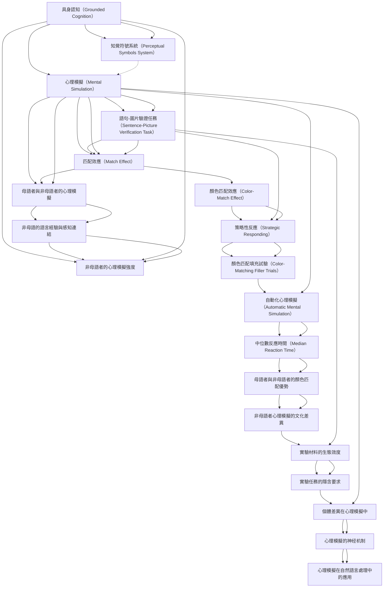

# Zettelkasten 卡片索引

**來源論文**: vanZuijlen-2024_Mental_Simulation
**作者**: 
**年份**: 2025
**生成日期**: 2025-10-29 16:48
**卡片總數**: 20

---

## 📚 卡片清單

### 1. [具身認知（Grounded Cognition）](zettel_cards/CogSci-20251029-001.md)
- **ID**: `CogSci-20251029-001`
- **類型**: 
- **核心**: "According to grounded cognition theories, the features that are activated during language comprehension are based on earlier perceptual-motor experiences with the objects described in the sentences (Barsalou, 1999; Barsalou et al., 2003)."
- **標籤**: `具身認知`, `語言理解`, `感知-運動經驗`

### 2. [心理模擬（Mental Simulation）](zettel_cards/CogSci-20251029-002.md)
- **ID**: `CogSci-20251029-002`
- **類型**: 
- **核心**: "On this account, people represent the meaning of language by mentally simulating the perceptual and motor processes that they would also have used if they were immersed in the real-world equivalent of what is described by the language."
- **標籤**: `心理模擬`, `語言理解`, `具身認知`

### 3. [語句-圖片驗證任務（Sentence-Picture Verification Task）](zettel_cards/CogSci-20251029-003.md)
- **ID**: `CogSci-20251029-003`
- **類型**: 
- **核心**: "In this so-called sentence-picture verification task, participants decide whether the object presented immediately after the sentence was mentioned in the preceding sentence or not."
- **標籤**: `語句-圖片驗證任務`, `實驗方法`, `語言理解`

### 4. [匹配效應（Match Effect）](zettel_cards/CogSci-20251029-004.md)
- **ID**: `CogSci-20251029-004`
- **類型**: 
- **核心**: "It seems that participants mentally simulate the content of the sentence, and that subsequent verification of the depicted object is faster and more accurate when the visual feature implied by the sentence matches that of the picture even though that feature was not explicitly mentioned."
- **標籤**: `匹配效應`, `心理模擬`, `語句-圖片驗證任務`

### 5. [知覺符號系統（Perceptual Symbols System）](zettel_cards/CogSci-20251029-005.md)
- **ID**: `CogSci-20251029-005`
- **類型**: 
- **核心**: "Mental simulation is assumed to be unconscious, and is the underlying process of conceptual processing (Pecher, van Dantzig, & Schifferstein, 2009a, 2009b; Solomon & Barsalou, 2004; Vermeulen et al., 2008; Zwaan & Pecher, 2012)."
- **標籤**: `知覺符號系統`, `心理模擬`, `概念處理`

### 6. [母語者與非母語者的心理模擬](zettel_cards/CogSci-20251029-006.md)
- **ID**: `CogSci-20251029-006`
- **類型**: 
- **核心**: "In the present study we investigated whether such mental simulations also underlie understanding of non-native languages."
- **標籤**: `母語`, `非母語`, `心理模擬`, `語言理解`

### 7. [非母語的語言經驗與感知連結](zettel_cards/CogSci-20251029-007.md)
- **ID**: `CogSci-20251029-007`
- **類型**: 
- **核心**: "Especially for a second language that is learned later in life, in a formal setting such as school, people may have weaker links between language and sensory experiences (Foroni, 2015; Kogan et al., 2020; Norman & Peleg, 2022)."
- **標籤**: `非母語`, `語言學習`, `感知連結`, `具身認知`

### 8. [非母語者的心理模擬強度](zettel_cards/CogSci-20251029-008.md)
- **ID**: `CogSci-20251029-008`
- **類型**: 
- **核心**: "The strength of mental simulations may depend on proficiency in the second language (e.g., Dijkstra & van Heuven, 2002; Monaco et al., 2019; van Heuven & Dijkstra, 2010; Zhao et al., 2019; but see Bergen et al., 2010)."
- **標籤**: `非母語`, `語言熟練度`, `心理模擬強度`, `具身認知`

### 9. [顏色匹配效應（Color-Match Effect）](zettel_cards/CogSci-20251029-009.md)
- **ID**: `CogSci-20251029-009`
- **類型**: 
- **核心**: "Rather, both studies reported a positive match effect of color (i.e., a match advantage), where images that matched the preceding sentence on the object and color produced faster responses than images that mismatched the color (also see De Koning et al., 2017)."
- **標籤**: `顏色匹配效應`, `心理模擬`, `語句-圖片驗證任務`

### 10. [策略性反應（Strategic Responding）](zettel_cards/CogSci-20251029-010.md)
- **ID**: `CogSci-20251029-010`
- **類型**: 
- **核心**: "A noticeable feature of the sentence-picture verification task is that there is a correlation between the match status (match vs. mismatch) and the required (i.e., correct) response (‘’yes’’ vs. ‘’no’’)."
- **標籤**: `策略性反應`, `語句-圖片驗證任務`, `實驗設計`

### 11. [顏色匹配填充試驗（Color-Matching Filler Trials）](zettel_cards/CogSci-20251029-011.md)
- **ID**: `CogSci-20251029-011`
- **類型**: 
- **核心**: "We removed this correlation by including color-matching filler trials and investigated if the color-match effect was still obtained."
- **標籤**: `顏色匹配填充試驗`, `實驗控制`, `語句-圖片驗證任務`

### 12. [自動化心理模擬（Automatic Mental Simulation）](zettel_cards/CogSci-20251029-012.md)
- **ID**: `CogSci-20251029-012`
- **類型**: 
- **核心**: "If sensory simulation is an integral part of language comprehension, simulations should be automatic whenever language comprehenders process the meaning of a sentence."
- **標籤**: `自動化心理模擬`, `語言理解`, `具身認知`

### 13. [中位數反應時間（Median Reaction Time）](zettel_cards/CogSci-20251029-013.md)
- **ID**: `CogSci-20251029-013`
- **類型**: 
- **核心**: "In both a native sample (Experiment 1) and a non-native sample (Experiment 2), we found strong evidence for a color-match advantage on median reaction time and error rates."
- **標籤**: `中位數反應時間`, `數據分析`, `實驗結果`

### 14. [母語者與非母語者的顏色匹配優勢](zettel_cards/CogSci-20251029-014.md)
- **ID**: `CogSci-20251029-014`
- **類型**: 
- **核心**: "In both a native sample (Experiment 1) and a non-native sample (Experiment 2), we found strong evidence for a color-match advantage on median reaction time and error rates."
- **標籤**: `顏色匹配優勢`, `母語者`, `非母語者`, `心理模擬`

### 15. [非母語者心理模擬的文化差異](zettel_cards/CogSci-20251029-015.md)
- **ID**: `CogSci-20251029-015`
- **類型**: 
- **核心**: This study did not explore the impact of cultural background on mental simulation processes in non-native speakers.
- **標籤**: `文化差異`, `非母語`, `心理模擬`, `語言理解`

### 16. [實驗材料的生態效度](zettel_cards/CogSci-20251029-016.md)
- **ID**: `CogSci-20251029-016`
- **類型**: 
- **核心**: How well do the artificial sentences and object pictures used in the experiment reflect real-world language use and object perception?
- **標籤**: `生態效度`, `實驗設計`, `語言理解`, `知覺`

### 17. [實驗任務的隱含要求](zettel_cards/CogSci-20251029-017.md)
- **ID**: `CogSci-20251029-017`
- **類型**: 
- **核心**: Could the sentence-picture verification task inadvertently encourage participants to focus on color, even if they wouldn't normally do so during language comprehension?
- **標籤**: `實驗任務`, `隱含要求`, `顏色`, `語言理解`

### 18. [個體差異在心理模擬中](zettel_cards/CogSci-20251029-018.md)
- **ID**: `CogSci-20251029-018`
- **類型**: 
- **核心**: How do individual differences in cognitive abilities (e.g., working memory capacity, spatial reasoning) affect the strength and nature of mental simulation during language comprehension?
- **標籤**: `個體差異`, `認知能力`, `心理模擬`, `語言理解`

### 19. [心理模擬的神经机制](zettel_cards/CogSci-20251029-019.md)
- **ID**: `CogSci-20251029-019`
- **類型**: 
- **核心**: What are the neural correlates of mental simulation during language comprehension, and how do they differ between native and non-native speakers?
- **標籤**: `神经机制`, `心理模拟`, `母语者`, `非母语者`

### 20. [心理模擬在自然語言處理中的應用](zettel_cards/CogSci-20251029-020.md)
- **ID**: `CogSci-20251029-020`
- **類型**: 
- **核心**: Can insights from mental simulation research be used to improve natural language processing (NLP) models, making them more human-like in their understanding of language?
- **標籤**: `自然语言处理`, `NLP`, `心理模拟`, `人工智能`

---

## 🗺️ 概念網絡圖

---

## 🏷️ 標籤索引

### 具身認知
- [[CogSci-20251029-001]] 具身認知（Grounded Cognition）
- [[CogSci-20251029-002]] 心理模擬（Mental Simulation）
- [[CogSci-20251029-007]] 非母語的語言經驗與感知連結
- [[CogSci-20251029-008]] 非母語者的心理模擬強度
- [[CogSci-20251029-012]] 自動化心理模擬（Automatic Mental Simulation）

### 語言理解
- [[CogSci-20251029-001]] 具身認知（Grounded Cognition）
- [[CogSci-20251029-002]] 心理模擬（Mental Simulation）
- [[CogSci-20251029-003]] 語句-圖片驗證任務（Sentence-Picture Verification Task）
- [[CogSci-20251029-006]] 母語者與非母語者的心理模擬
- [[CogSci-20251029-012]] 自動化心理模擬（Automatic Mental Simulation）
- [[CogSci-20251029-015]] 非母語者心理模擬的文化差異
- [[CogSci-20251029-016]] 實驗材料的生態效度
- [[CogSci-20251029-017]] 實驗任務的隱含要求
- [[CogSci-20251029-018]] 個體差異在心理模擬中

### 感知-運動經驗
- [[CogSci-20251029-001]] 具身認知（Grounded Cognition）

### 心理模擬
- [[CogSci-20251029-002]] 心理模擬（Mental Simulation）
- [[CogSci-20251029-004]] 匹配效應（Match Effect）
- [[CogSci-20251029-005]] 知覺符號系統（Perceptual Symbols System）
- [[CogSci-20251029-006]] 母語者與非母語者的心理模擬
- [[CogSci-20251029-009]] 顏色匹配效應（Color-Match Effect）
- [[CogSci-20251029-014]] 母語者與非母語者的顏色匹配優勢
- [[CogSci-20251029-015]] 非母語者心理模擬的文化差異
- [[CogSci-20251029-018]] 個體差異在心理模擬中

### 語句-圖片驗證任務
- [[CogSci-20251029-003]] 語句-圖片驗證任務（Sentence-Picture Verification Task）
- [[CogSci-20251029-004]] 匹配效應（Match Effect）
- [[CogSci-20251029-009]] 顏色匹配效應（Color-Match Effect）
- [[CogSci-20251029-010]] 策略性反應（Strategic Responding）
- [[CogSci-20251029-011]] 顏色匹配填充試驗（Color-Matching Filler Trials）

### 實驗方法
- [[CogSci-20251029-003]] 語句-圖片驗證任務（Sentence-Picture Verification Task）

### 匹配效應
- [[CogSci-20251029-004]] 匹配效應（Match Effect）

### 知覺符號系統
- [[CogSci-20251029-005]] 知覺符號系統（Perceptual Symbols System）

### 概念處理
- [[CogSci-20251029-005]] 知覺符號系統（Perceptual Symbols System）

### 母語
- [[CogSci-20251029-006]] 母語者與非母語者的心理模擬

### 非母語
- [[CogSci-20251029-006]] 母語者與非母語者的心理模擬
- [[CogSci-20251029-007]] 非母語的語言經驗與感知連結
- [[CogSci-20251029-008]] 非母語者的心理模擬強度
- [[CogSci-20251029-015]] 非母語者心理模擬的文化差異

### 語言學習
- [[CogSci-20251029-007]] 非母語的語言經驗與感知連結

### 感知連結
- [[CogSci-20251029-007]] 非母語的語言經驗與感知連結

### 語言熟練度
- [[CogSci-20251029-008]] 非母語者的心理模擬強度

### 心理模擬強度
- [[CogSci-20251029-008]] 非母語者的心理模擬強度

### 顏色匹配效應
- [[CogSci-20251029-009]] 顏色匹配效應（Color-Match Effect）

### 策略性反應
- [[CogSci-20251029-010]] 策略性反應（Strategic Responding）

### 實驗設計
- [[CogSci-20251029-010]] 策略性反應（Strategic Responding）
- [[CogSci-20251029-016]] 實驗材料的生態效度

### 顏色匹配填充試驗
- [[CogSci-20251029-011]] 顏色匹配填充試驗（Color-Matching Filler Trials）

### 實驗控制
- [[CogSci-20251029-011]] 顏色匹配填充試驗（Color-Matching Filler Trials）

### 自動化心理模擬
- [[CogSci-20251029-012]] 自動化心理模擬（Automatic Mental Simulation）

### 中位數反應時間
- [[CogSci-20251029-013]] 中位數反應時間（Median Reaction Time）

### 數據分析
- [[CogSci-20251029-013]] 中位數反應時間（Median Reaction Time）

### 實驗結果
- [[CogSci-20251029-013]] 中位數反應時間（Median Reaction Time）

### 顏色匹配優勢
- [[CogSci-20251029-014]] 母語者與非母語者的顏色匹配優勢

### 母語者
- [[CogSci-20251029-014]] 母語者與非母語者的顏色匹配優勢

### 非母語者
- [[CogSci-20251029-014]] 母語者與非母語者的顏色匹配優勢

### 文化差異
- [[CogSci-20251029-015]] 非母語者心理模擬的文化差異

### 生態效度
- [[CogSci-20251029-016]] 實驗材料的生態效度

### 知覺
- [[CogSci-20251029-016]] 實驗材料的生態效度

### 實驗任務
- [[CogSci-20251029-017]] 實驗任務的隱含要求

### 隱含要求
- [[CogSci-20251029-017]] 實驗任務的隱含要求

### 顏色
- [[CogSci-20251029-017]] 實驗任務的隱含要求

### 個體差異
- [[CogSci-20251029-018]] 個體差異在心理模擬中

### 認知能力
- [[CogSci-20251029-018]] 個體差異在心理模擬中

### 神经机制
- [[CogSci-20251029-019]] 心理模擬的神经机制

### 心理模拟
- [[CogSci-20251029-019]] 心理模擬的神经机制
- [[CogSci-20251029-020]] 心理模擬在自然語言處理中的應用

### 母语者
- [[CogSci-20251029-019]] 心理模擬的神经机制

### 非母语者
- [[CogSci-20251029-019]] 心理模擬的神经机制

### 自然语言处理
- [[CogSci-20251029-020]] 心理模擬在自然語言處理中的應用

### NLP
- [[CogSci-20251029-020]] 心理模擬在自然語言處理中的應用

### 人工智能
- [[CogSci-20251029-020]] 心理模擬在自然語言處理中的應用

---

## 📖 閱讀建議順序

1. [[CogSci-20251029-005]] 知覺符號系統（Perceptual Symbols System）

2. [[CogSci-20251029-008]] 非母語者的心理模擬強度

3. [[CogSci-20251029-011]] 顏色匹配填充試驗（Color-Matching Filler Trials）

4. [[CogSci-20251029-015]] 非母語者心理模擬的文化差異

5. [[CogSci-20251029-017]] 實驗任務的隱含要求

6. [[CogSci-20251029-020]] 心理模擬在自然語言處理中的應用

7. [[CogSci-20251029-004]] 匹配效應（Match Effect）

8. [[CogSci-20251029-006]] 母語者與非母語者的心理模擬

9. [[CogSci-20251029-007]] 非母語的語言經驗與感知連結

10. [[CogSci-20251029-009]] 顏色匹配效應（Color-Match Effect）

11. [[CogSci-20251029-010]] 策略性反應（Strategic Responding）

12. [[CogSci-20251029-012]] 自動化心理模擬（Automatic Mental Simulation）

13. [[CogSci-20251029-013]] 中位數反應時間（Median Reaction Time）

14. [[CogSci-20251029-014]] 母語者與非母語者的顏色匹配優勢

15. [[CogSci-20251029-016]] 實驗材料的生態效度

16. [[CogSci-20251029-018]] 個體差異在心理模擬中

17. [[CogSci-20251029-019]] 心理模擬的神经机制

18. [[CogSci-20251029-001]] 具身認知（Grounded Cognition）

19. [[CogSci-20251029-003]] 語句-圖片驗證任務（Sentence-Picture Verification Task）

20. [[CogSci-20251029-002]] 心理模擬（Mental Simulation）

---

*本索引由 Knowledge Production System 自動生成*