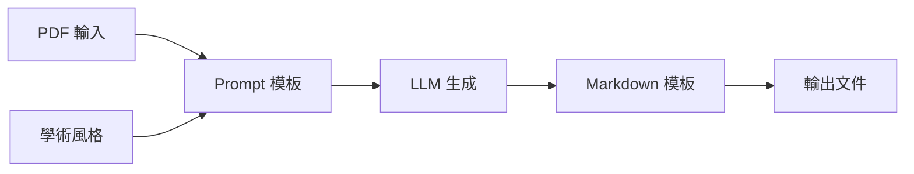

# 📚 模板庫

本目錄包含知識生產器系統的所有模板，包括 Prompt 模板、學術風格定義和 Markdown 輸出模板。

---

## 📁 目錄結構

```
templates/
├── prompts/                 # Prompt 模板
│   ├── journal_club_template.jinja2
│   ├── zettelkasten_template.jinja2
│   ├── raw_templates.txt
│   └── README.md
├── styles/                  # 學術風格定義
│   ├── academic_styles.yaml
│   └── README.md
├── markdown/                # Markdown 輸出模板
│   ├── academic_slides.jinja2
│   ├── zettelkasten_card.jinja2
│   ├── zettelkasten_index.jinja2
│   └── README.md
└── README.md               # 本文件
```

---

## 🎯 模板類型

### 1. Prompt 模板 (prompts/)

**用途**: 生成 LLM Prompt，指導內容生成

**主要模板**:
- **journal_club_template.jinja2**: 學術簡報 Prompt
  - 8 種學術風格
  - 5 種詳細程度
  - 3 種語言模式

- **zettelkasten_template.jinja2**: Zettelkasten 筆記 Prompt
  - 語義化 ID
  - 4 種卡片類型
  - 6 種連結語義

**詳細說明**: [prompts/README.md](prompts/README.md)

---

### 2. 學術風格定義 (styles/)

**用途**: 定義學術內容的風格、語氣和結構

**配置文件**: academic_styles.yaml

**支援風格**:
1. **classic_academic**: 經典學術風格
2. **modern_academic** ⭐: 現代學術風格（預設）
3. **clinical**: 臨床導向
4. **research_methods**: 研究方法
5. **literature_review**: 文獻回顧
6. **case_analysis**: 案例分析
7. **teaching**: 教學導向
8. **zettelkasten** ✨: 卡片盒筆記

**詳細說明**: [styles/README.md](styles/README.md)

---

### 3. Markdown 模板 (markdown/)

**用途**: 生成 Markdown 格式的輸出文件

**主要模板**:
- **academic_slides.jinja2**: 學術簡報 Markdown
  - 相容 Marp / reveal.js
  - 自動分頁

- **zettelkasten_card.jinja2**: 單張筆記卡片
  - 結構化欄位
  - 連結網絡

- **zettelkasten_index.jinja2**: 卡片索引頁
  - 分類列表
  - Mermaid 網絡圖

**詳細說明**: [markdown/README.md](markdown/README.md)

---

## 🚀 快速開始

### 使用 Prompt 模板

```python
from jinja2 import Environment, FileSystemLoader

# 載入模板環境
env = Environment(loader=FileSystemLoader('templates/prompts'))
template = env.get_template('journal_club_template.jinja2')

# 渲染 Prompt
prompt = template.render(
    style='modern_academic',
    detail_level='standard',
    language='chinese',
    num_slides=15,
    content=pdf_content
)
```

### 使用學術風格

```python
import yaml

# 載入風格定義
with open('templates/styles/academic_styles.yaml') as f:
    styles = yaml.safe_load(f)

# 獲取風格特徵
style = styles['styles']['modern_academic']
print(style['characteristics'])
```

### 使用 Markdown 模板

```python
from jinja2 import Environment, FileSystemLoader

# 載入模板環境
env = Environment(loader=FileSystemLoader('templates/markdown'))
template = env.get_template('academic_slides.jinja2')

# 渲染 Markdown
markdown = template.render(
    title='簡報標題',
    subtitle='副標題',
    slides=[...]
)
```

---

## 📊 模板使用流程



### 詳細步驟

1. **選擇風格** (`styles/academic_styles.yaml`)
   - 根據聽眾和場合選擇風格
   - 設定詳細程度和語言

2. **生成 Prompt** (`prompts/*.jinja2`)
   - 使用 Jinja2 渲染 Prompt
   - 結合 PDF 內容和風格配置

3. **LLM 生成** (外部)
   - 調用 LLM API（Ollama / Gemini / OpenAI / Claude）
   - 獲取結構化內容

4. **渲染輸出** (`markdown/*.jinja2`)
   - 使用 Markdown 模板格式化
   - 生成最終文件

---

## 🎨 8 種學術風格對比

| 風格 | 語氣 | 強調 | 適用場景 |
|------|------|------|----------|
| classic_academic | 正式、嚴謹 | 理論、方法 | 研討會、論文答辯 |
| modern_academic ⭐ | 專業易懂 | 清晰溝通 | 會議報告、工作坊 |
| clinical | 實用導向 | 臨床應用 | 醫學簡報、臨床教學 |
| research_methods | 技術精確 | 方法學 | 方法研討、計畫報告 |
| literature_review | 綜合批判 | 知識缺口 | 文獻回顧、背景介紹 |
| case_analysis | 情境具體 | 實務應用 | 商業案例、政策評估 |
| teaching | 友善循序 | 概念理解 | 課堂教學、入門教材 |
| zettelkasten ✨ | 簡潔連結 | 知識網絡 | 知識管理、永久筆記 |

---

## 🔧 自定義模板

### 新增 Prompt 模板

1. 在 `prompts/` 創建 `.jinja2` 文件
2. 定義清楚的變數介面
3. 在生成器中整合

### 新增學術風格

1. 在 `styles/academic_styles.yaml` 添加定義
2. 更新 Prompt 模板邏輯
3. 測試不同組合

### 新增 Markdown 模板

1. 在 `markdown/` 創建 `.jinja2` 文件
2. 設計輸出結構
3. 在生成器中使用

**詳細指南**: 參見各子目錄的 README.md

---

## 📚 模板設計原則

### 1. 可維護性
- 使用 Jinja2 模板引擎
- 清楚的變數命名
- 結構化的配置文件（YAML）

### 2. 可擴展性
- 模組化設計（Prompt / Style / Output 分離）
- 支援自定義風格和模板
- 向後相容

### 3. 可讀性
- 詳細的文檔說明
- 範例代碼
- 使用建議

### 4. 實用性
- 基於真實需求設計（Journal Club、Zettelkasten）
- 多種風格和詳細程度組合
- 支援多種輸出格式

---

## 🎯 使用建議

### 學術簡報
1. 選擇合適的學術風格（[styles/](styles/)）
2. 使用 journal_club_template.jinja2（[prompts/](prompts/)）
3. 渲染為 Markdown（[markdown/academic_slides.jinja2](markdown/)）
4. 用 Marp 轉換為 PDF

### Zettelkasten 筆記
1. 使用 zettelkasten_template.jinja2（[prompts/](prompts/)）
2. 生成卡片和索引（[markdown/zettelkasten_*.jinja2](markdown/)）
3. 在 Obsidian 中管理

### 自定義需求
1. 研究現有模板結構
2. 創建新模板或修改現有模板
3. 測試並文檔化

---

## 📖 參考資源

### 內部文檔
- **完整開發文檔**: [../CLAUDE.md](../CLAUDE.md)
- **Prompt 模板**: [prompts/README.md](prompts/README.md)
- **學術風格**: [styles/README.md](styles/README.md)
- **Markdown 模板**: [markdown/README.md](markdown/README.md)

### 外部資源
- **Jinja2 文檔**: https://jinja.palletsprojects.com/
- **Marp**: https://marp.app/
- **Obsidian**: https://obsidian.md/
- **YAML 規範**: https://yaml.org/

### 設計靈感
- **SciMaker Journal Club**: 原始 Prompt 設計來源
- **Zettelkasten 方法**: Niklas Luhmann 的筆記系統

---

## 🔄 版本歷史

### v0.6.0-alpha (2025-11-06)
- ✅ 完整的 README 文檔體系
- ✅ 程式碼範例外部化
- ✅ 模板說明移動到子目錄

### v0.5.0-alpha (2025-10-31)
- ✅ 自動模型選擇系統

### v0.4.0-alpha (2025-10-29)
- ✅ 批次處理器和質量檢查器

### v0.3.0-alpha (2025-10-28)
- ✅ Zettelkasten 模板系統

---

**最後更新**: 2025-11-06
**版本**: v0.6.0-alpha
