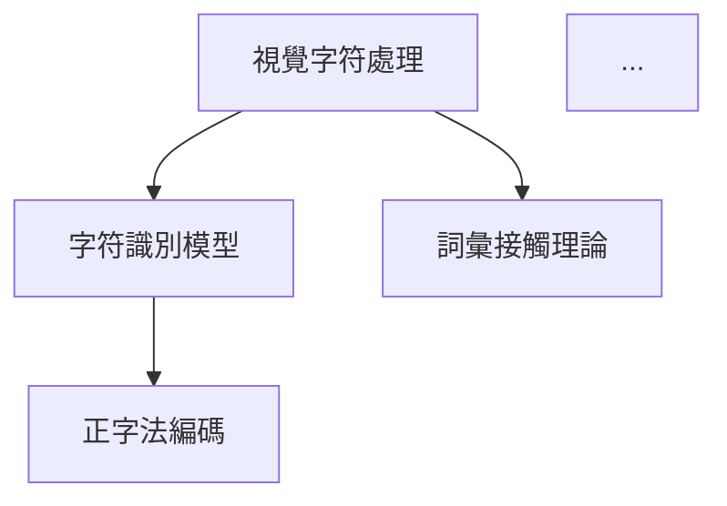

# 📄 Markdown 模板

本目錄包含 Markdown 格式的輸出模板，用於生成學術簡報和 Zettelkasten 筆記。

---

## 📁 文件說明

### academic_slides.jinja2

**用途**: 通用學術簡報 Markdown 模板（相容 Marp / reveal.js）

**特性**:
- 標準 Markdown 簡報格式
- 支援 Marp 和 reveal.js 解析
- 自動分頁（`---` 分隔符）
- 支援項目符號和圖表

**變數說明**:
```jinja2
{{ title }}           # 簡報標題
{{ subtitle }}        # 副標題
{{ author }}          # 作者
{{ date }}            # 日期
{{ slides }}          # 投影片內容列表
```

**輸出範例**:
```markdown
---
marp: true
theme: default
paginate: true
---

# 簡報標題
## 副標題

作者名稱
2024-11-06

---

## 投影片 1：研究背景

- 研究動機
- 研究問題
- 研究目標

---

## 投影片 2：研究方法

...
```

**使用範例**:
```python
from jinja2 import Template

with open('templates/markdown/academic_slides.jinja2') as f:
    template = Template(f.read())

markdown = template.render(
    title='深度學習應用',
    subtitle='認知科學視角',
    author='研究者',
    date='2024-11-06',
    slides=[
        {
            'title': '研究背景',
            'content': ['動機', '問題', '目標']
        },
        {
            'title': '研究方法',
            'content': ['設計', '參與者', '程序']
        }
    ]
)

with open('output/slides.md', 'w', encoding='utf-8') as f:
    f.write(markdown)
```

**搭配工具**:
- **Marp**: VS Code 擴充套件，即時預覽和匯出 PDF
  ```bash
  marp slides.md -o slides.pdf
  ```
- **reveal.js**: Web-based 簡報框架
  ```bash
  pandoc slides.md -t revealjs -s -o slides.html
  ```

---

### zettelkasten_card.jinja2

**用途**: 單張 Zettelkasten 卡片模板

**特性**:
- 語義化 ID 格式
- 結構化欄位（標題、類型、核心概念）
- 三層筆記系統（AI / Human）
- 連結網絡區塊

**變數說明**:
```jinja2
{{ card_id }}         # 卡片 ID（如 CogSci-20241106-001）
{{ title }}           # 卡片標題
{{ card_type }}       # 卡片類型（concept/method/finding/question）
{{ core_concept }}    # 核心概念（原文引用）
{{ description }}     # 簡短描述
{{ content }}         # 詳細內容
{{ links }}           # 連結網絡列表
{{ source }}          # 來源脈絡
{{ ai_notes }}        # AI 生成的批判性思考
{{ human_notes }}     # 人類補充的筆記
{{ tags }}            # 標籤列表
```

**輸出範例**:
```markdown
# 視覺字符處理的正字法鄰居效應

**ID**: CogSci-20241106-001
**類型**: concept
**標籤**: #認知科學 #視覺字符 #正字法

## 核心概念

Orthographic neighborhood effect in visual character processing

## 描述

說明正字法鄰居效應如何影響視覺字符識別的速度和準確度...

## 內容

詳細內容...

## 連結網絡

- **基於**: [[CogSci-20241106-002|字符識別模型]]
- **導向**: [[CogSci-20241106-005|詞彙接觸理論]]
- **相關**: [[CogSci-20241106-008|語音編碼]]

## 來源脈絡

**論文**: Liu et al. (2012)
**章節**: Introduction, p.2-3

## AI 筆記

**[AI Agent]**: 此概念在中文字符處理中的應用需要考慮...

## 人類筆記

**[Human]**: (TODO) 補充個人思考和應用案例

<!-- 提示：請在此添加您的筆記、想法或相關經驗 -->
```

**使用範例**:
```python
from jinja2 import Template

with open('templates/markdown/zettelkasten_card.jinja2') as f:
    template = Template(f.read())

card = template.render(
    card_id='CogSci-20241106-001',
    title='視覺字符處理',
    card_type='concept',
    core_concept='Orthographic neighborhood effect',
    description='正字法鄰居效應...',
    content='詳細內容...',
    links=[
        {'type': '基於', 'target_id': 'CogSci-20241106-002', 'target_title': '字符識別'},
        {'type': '導向', 'target_id': 'CogSci-20241106-005', 'target_title': '詞彙接觸'}
    ],
    source='Liu et al. (2012), p.2-3',
    ai_notes='AI 的批判性思考...',
    human_notes='',
    tags=['認知科學', '視覺字符', '正字法']
)
```

---

### zettelkasten_index.jinja2

**用途**: Zettelkasten 索引頁面模板

**特性**:
- 卡片列表（按類型分類）
- Mermaid 概念網絡圖
- 標籤索引
- 快速導航

**變數說明**:
```jinja2
{{ paper_info }}      # 論文元數據
{{ card_count }}      # 卡片總數
{{ cards_by_type }}   # 按類型分組的卡片
{{ tags }}            # 所有標籤
{{ network_graph }}   # Mermaid 圖表代碼
```

**輸出範例**:
```markdown
# Zettelkasten 索引：論文標題

**來源論文**: Author et al. (2024)
**卡片總數**: 20 張
**生成日期**: 2024-11-06

---

## 📊 卡片分布

- **概念卡** (concept): 8 張
- **方法卡** (method): 5 張
- **發現卡** (finding): 5 張
- **問題卡** (question): 2 張

---

## 📋 卡片列表

### 概念卡 (Concept)

1. [[zettel_cards/CogSci-20241106-001.md|視覺字符處理]]
2. [[zettel_cards/CogSci-20241106-002.md|字符識別模型]]
...

### 方法卡 (Method)

1. [[zettel_cards/CogSci-20241106-009.md|正字法鄰居測量]]
...

---

## 🗺️ 概念網絡



---

## 🏷️ 標籤索引

### #認知科學
- CogSci-20241106-001, 002, 003...

### #視覺字符
- CogSci-20241106-001, 004, 007...
```

**使用範例**:
```python
from jinja2 import Template

with open('templates/markdown/zettelkasten_index.jinja2') as f:
    template = Template(f.read())

index = template.render(
    paper_info={
        'title': 'Paper Title',
        'authors': 'Author et al.',
        'year': 2024
    },
    card_count=20,
    cards_by_type={
        'concept': [...],
        'method': [...],
        'finding': [...],
        'question': [...]
    },
    tags={'認知科學': [...], '視覺字符': [...]},
    network_graph='graph TD\n    A --> B\n    ...'
)
```

---

## 📊 輸出格式比較

| 模板 | 用途 | 相容工具 | 輸出類型 |
|------|------|---------|----------|
| academic_slides.jinja2 | 學術簡報 | Marp, reveal.js, Pandoc | 簡報（Markdown） |
| zettelkasten_card.jinja2 | 單張筆記卡片 | Obsidian, Logseq, Roam | 筆記（Markdown） |
| zettelkasten_index.jinja2 | 卡片索引頁 | Obsidian, Logseq | 索引（Markdown） |

---

## 🔧 自定義模板

### 新增模板步驟

1. **創建 Jinja2 模板** (`my_template.jinja2`):
   ```jinja2
   # {{ title }}

   {{ content }}
   ```

2. **在生成器中使用**:
   ```python
   from jinja2 import Environment, FileSystemLoader

   env = Environment(loader=FileSystemLoader('templates/markdown'))
   template = env.get_template('my_template.jinja2')

   output = template.render(title='標題', content='內容')
   ```

3. **測試輸出**:
   ```bash
   python my_generator.py --output test.md
   ```

---

## 🎯 使用建議

### 學術簡報
- 使用 **academic_slides.jinja2**
- 搭配 Marp 進行即時預覽
- 匯出為 PDF 或 HTML

### Zettelkasten 筆記
- 使用 **zettelkasten_card.jinja2** 和 **zettelkasten_index.jinja2**
- 在 Obsidian 中管理筆記網絡
- 利用雙向連結功能

### 自動化工作流
- 整合到 `make_slides.py` 或 `zettel_maker.py`
- 批次生成 Markdown 文件
- 版本控制（Git）追蹤變更

---

## 📚 參考資源

- **Marp**: https://marp.app/
- **reveal.js**: https://revealjs.com/
- **Jinja2 文檔**: https://jinja.palletsprojects.com/
- **Obsidian**: https://obsidian.md/
- **Zettelkasten 方法**: https://zettelkasten.de/

---

**最後更新**: 2025-11-06
**版本**: v0.6.0-alpha
